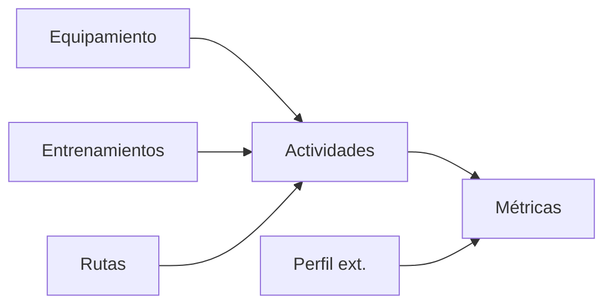

# Especificación Técnica — Bloque D (Núcleo funcional del usuario)

**Nivel:** producción/empresarial · **Estado:** documento de diseño y
referencia con desviaciones reales registradas; D1 y D2 ya fueron
implementados/verificados, mientras los módulos posteriores conservan su
carácter propuesto hasta su implementación. Complementa (no reemplaza)
`docs/TECHNICAL_SPECIFICATION_M0_M1.md`, que sigue siendo autoritativo
para Auth/Perfil tal como ya están implementados (Bloque C).

**Revisión 2 (2026-07-22):** el módulo 2 se rediseñó por completo — la
versión anterior (`bikes` + `devices` como dos tablas separadas) quedó
descartada por estar centrada en bicicletas y por modelar el mismo
concepto (un rodillo inteligente) en dos lugares distintos a la vez
(`bikes.type = 'indoor'` y `devices.type = 'smart_trainer'`). Se
reemplaza por un modelo **Equipment** único y polimórfico (sección 2).
Eso desplazó la numeración de los módulos 4-8 originales a 3-7 y ajustó
las secciones 1 (Perfil), 4 (Actividades), 9 (migraciones) y 10 (primera
tarea). El resto del documento (Entrenamientos, Rutas, Métricas,
preparación futura) no cambió de contenido, solo de número de sección.

---

## 0. Nota de alcance y relación con el roadmap original

El `ROADMAP_M0_M1.md` original dejaba anotado un único ítem para el
Bloque D: `GET /admin/users` (panel de administración). Este documento
**reemplaza y amplía** ese alcance — el Bloque D pasa a ser el núcleo
funcional visible para el usuario final (perfil, equipamiento,
entrenamientos, historial, rutas, métricas), no el panel de
administración. El panel de administración **no se descarta**: sigue
siendo trabajo real y necesario (ver módulo 5, "Rutas", que ya señala su
dependencia operativa de un panel para gestionar contenido a escala),
pero pasa a ser una consecuencia natural de tener ya el núcleo de datos
sobre el que administrar, no el punto de partida. Se reordena, no se
elimina.

### 0.1 Decisiones transversales (aplican a los módulos siguientes)

Estas decisiones se toman una sola vez aquí para no repetirlas ni
contradecirlas módulo a módulo:

1. **Todo lo nuevo va directo a PostgreSQL/NestJS, no a Firestore.** La
   nota de reconciliación arquitectónica de la spec M0/M1 (sección 0) ya
   distingue "capa actual (Firestore)" de "capa objetivo (NestJS)".
   Ningún dominio de este bloque (equipamiento, entrenamientos, rutas
   reales, métricas) tiene hoy una colección Firestore que reconciliar —
   construirlos en Firestore sería añadir deuda nueva a un sistema que
   el propio proyecto ya está migrando fuera. Solo "Actividades e
   historial" tiene una contraparte Firestore existente
   (`users/{uid}/ride_sessions`, en producción hoy); ese caso se trata
   explícitamente en el módulo 4.
2. **Las entidades de dominio ya existentes en Flutter son el contrato,
   no una sugerencia.** Mismo principio que ya se aplicó en C1
   (`AuthApiContract`): `BleDevice`, `SportDeviceType`, `TrainingRoute`,
   `RideSessionRecord`, `StatisticsSummary`,
   `WearableConnection`/`ExternalActivity` ya definen campos, enums y
   semántica en el cliente. Los DTOs/columnas nuevas de este documento
   reutilizan esos nombres y rangos donde el concepto ya existe, para
   que una futura migración del datasource Flutter sea un cambio de
   implementación, no de contrato.
3. **Unidades: todo se almacena en métrico en el servidor, siempre.**
   `preferred_units` (módulo 1) es una preferencia de **presentación**
   en el cliente, nunca de almacenamiento. Ninguna tabla de este bloque
   tiene una columna "en millas" o "en libras" — decidir esto ahora evita
   el bug clásico de doble-unidad que aparece cuando se pospone.
4. **Patrón de ownership repetido → helper compartido, no copy-paste.**
   Equipamiento, entrenamientos y actividades comparten la misma regla
   ("un recurso con `user_id` solo es visible/editable por su dueño,
   `404` — no `403` — si no lo es, para no confirmar su existencia a otro
   usuario"). Ya hubo un hallazgo de duplicación real en la auditoría de
   Bloque C (`AUTH_INVALID_CREDENTIALS` repetido). Antes de escribir el
   primer módulo nuevo, corresponde extraer un helper
   (`assertOwned(resource, userId)` o equivalente, en `src/common/`) y
   que los tres módulos lo reutilicen desde el día uno — no refactorizar
   después de escribirlo tres veces.
5. **No crear columnas ni tablas para funcionalidad no confirmada.**
   Clases grupales, avatares y tiempo real (módulo 7) se resuelven con
   **decisiones documentadas**, no con columnas `NULL` sin ningún caso de
   uso real todavía. Esto **no contradice** el uso de `equipment.specs
   JSONB` en el módulo 2: ahí la variabilidad es real y está confirmada
   HOY (una bici y un pulsómetro tienen atributos propios distintos, no
   hipotéticos) — mismo precedente que ya usa este proyecto en
   `audit_log.metadata JSONB` (`0001_init.sql`) para datos
   "estructurados pero variables según el caso", no un cajón de sastre
   sin definición.
6. **Todos los endpoints de este bloque son `/me`-scoped (autoservicio).**
   La matriz de permisos de la spec M0/M1 (sección 4) ya prevé
   "coach viendo atletas asignados" y "admin gestionando todo", pero esa
   visibilidad cruzada es explícitamente **M7/panel admin**, fuera de
   alcance aquí (instrucción explícita: no implementar clases grupales
   todavía, y la asignación coach→atleta es la misma familia de problema).
   Cada módulo deja notado, donde aplica, el punto de extensión concreto
   para cuando esa visibilidad cruzada se construya.
7. **Una categoría nueva de equipamiento nunca debe requerir tocar el
   esquema de tablas ya construidas.** Es el requisito explícito que
   motivó la revisión 2 de este documento — ver módulo 2 para el
   mecanismo concreto (tabla de referencia + `specs JSONB` + mapa de
   validación por categoría, exactamente igual al patrón `roles` ya
   usado en `0001_init.sql`).

### 0.2 Convenciones de implementación (heredadas de C1-C5, se mantienen)

`pg.Pool` directo sin ORM · migraciones SQL versionadas a mano
(`{secuencia}_{descripcion}.sql`, aplicadas con `psql -f`) · un módulo
Nest por dominio (`module.ts`/`controller.ts`/`service.ts`/
`repository.ts`/`dto/`) · `JwtAuthGuard` + `@CurrentUser()` en todo
endpoint autenticado · `ApiExceptionFilter` global para el sobre de error
único · DTOs con `class-validator` replicando cualquier `CHECK` de base
que exista, para devolver `400 VALIDATION_ERROR` en vez de un error
genérico de Postgres.

---

## 1. Perfil de usuario (extensión)

**Objetivo:** ampliar el perfil ya implementado (C5) con las
preferencias que los módulos nuevos necesitan (unidades, FC máxima,
onboarding), sin romper el contrato ya en producción de
`GET/PATCH/DELETE /users/me`.

**Modelo de datos** — migración aditiva sobre `users` (0007, ver orden en
sección 9). **Cambio respecto a la revisión 1:** ya no incluye
`default_bike_id` — con el modelo Equipment unificado (módulo 2),
"la bici por defecto del usuario" se resuelve con una consulta
(`SELECT ... FROM equipment WHERE user_id = $1 AND category_code =
'bike' AND is_default AND archived_at IS NULL`), no con una columna
duplicada en `users`. Esto además elimina una dependencia: Perfil ya no
necesita que Equipment exista primero a nivel de esquema.
```sql
ALTER TABLE users
  ADD COLUMN preferred_units VARCHAR(10) NOT NULL DEFAULT 'metric'
      CHECK (preferred_units IN ('metric', 'imperial')),
  ADD COLUMN max_heart_rate SMALLINT
      CHECK (max_heart_rate IS NULL OR max_heart_rate BETWEEN 60 AND 220),
  ADD COLUMN onboarding_completed_at TIMESTAMPTZ;
```

**Relaciones:** ninguna nueva (a diferencia de la revisión 1).

**Endpoints:** ninguno nuevo — se amplía `UpdateProfileDto` (PATCH
`/users/me` ya existente) con los tres campos, todos opcionales.

**Permisos:** los mismos ya vigentes (`JwtAuthGuard`, self-only).

**Validaciones:** `preferred_units` enum; `max_heart_rate` rango 60-220
(mismo criterio de "rango razonable de dominio" que ya usa `ftp`).

**Reglas de negocio:** `onboarding_completed_at` se escribe una sola vez
(primera vez que el cliente lo envía en `true`); el servicio ignora un
intento posterior de "des-completar" el onboarding — no hay caso de uso
real para eso.

**Pruebas unitarias:** `UsersService.updateProfile` — cada campo nuevo
válido/inválido.

**Pruebas e2e:** `PATCH /users/me` con los 3 campos nuevos.

**Riesgos:** ninguno nuevo relevante — al no depender de ninguna FK
externa, esta migración puede aplicarse en cualquier momento respecto a
las demás.

**Dependencias:** ninguna.

**Criterios de aceptación:** los 32 tests de perfil ya existentes (C5)
siguen en verde sin cambios; los campos nuevos son 100% aditivos
(ningún consumidor actual del endpoint se rompe por su ausencia).

**Decisión para escalar:** fijar ahora mismo, por escrito, que el
servidor **nunca** almacena una segunda copia de un valor en otra
unidad — cualquier conversión (`km` ↔ `mi`, `kg` ↔ `lb`) ocurre
exclusivamente en la capa de presentación del cliente, leyendo
`preferred_units`. Revertir esta decisión más adelante implicaría
migrar datos, no solo agregar una columna.

---

## 2. Equipamiento (bicicletas, entrenadores inteligentes, sensores y expansión futura)

> **✅ Implementado y verificado (2026-07-22)** — D1 completo contra
> Postgres real (36 tests unitarios + e2e nuevos, todos en verde). El
> diseño de abajo es el propuesto; la sub-sección **2.14 "Desviaciones
> reales de implementación"** documenta en qué difiere el código final
> de este boceto y por qué — léela después de 2.1-2.13 para tener el
> estado exacto, no solo el planeado.

**Objetivo:** un modelo **único y polimórfico** para todo lo que un
usuario posee y usa para entrenar — bicicletas, rodillos/entrenadores
inteligentes, sensores BLE (potenciómetro, pulsómetro, cadencia,
velocidad) — de forma que **incorporar una categoría nueva (zapatillas,
ruedas, potenciómetro de pedales, un rodillo de marca nueva, un casco con
sensor de impacto) nunca requiera alterar una tabla ya construida.**
Esta es la revisión explícita pedida antes de implementar D1: la
versión anterior trataba "bicicletas" y "sensores" como dos conceptos
separados, y un rodillo inteligente quedaba ambiguo entre ambos (era a
la vez `bikes.type = 'indoor'` y `devices.type = 'smart_trainer'`) — un
síntoma directo de diseño centrado en bicicletas, no en equipamiento en
general.

**Aclaración crítica que se mantiene igual que en la revisión 1:** el
emparejamiento/conexión BLE en sí **sigue siendo 100% local** (spec
M0/M1, sección 6.1, `flutter_blue_plus` → `BleDataSource` →
`TelemetryAggregator`, sin red de por medio). Este módulo no reemplaza
ni interviene ese flujo — añade un directorio backend *paralelo y
opcional* con fines de historial, asociación y analítica.

### 2.1 Diseño: por qué esta forma y no otras

Se consideraron tres formas de modelar "equipamiento polimórfico" en
Postgres sin ORM:

| Opción | Descripción | Por qué se descarta / se adopta |
|---|---|---|
| **A. Tabla ancha con columnas por tipo** | Una sola tabla `equipment` con una columna nullable por cada atributo posible de cada categoría (`weight_kg`, `max_resistance_watts`, `ble_device_id`, ...). | Descartada: cada categoría nueva sigue exigiendo `ALTER TABLE` para sus columnas propias — exactamente lo que se quiere evitar. |
| **B. Herencia por tabla (subtipos)** | Tabla base `equipment` + una tabla hija por categoría (`equipment_bikes`, `equipment_trainers`, ...). | Descartada como mecanismo *principal*: cada categoría nueva sigue exigiendo una tabla nueva (aceptable para categorías con mucha lógica propia, pero exagerado para "zapatillas" o "ruedas", que solo necesitan 2-3 atributos). |
| **C. Núcleo relacional + atributos variables en `specs JSONB`** | Tabla base `equipment` con lo común a **cualquier** categoría (nombre, marca, modelo, distancia/tiempo acumulado, default, archivado) + una columna `specs JSONB` para lo que varía por categoría, validada en la capa de aplicación (no en la base) mediante un mapa de validadores por categoría. | **Adoptada.** Es el mismo principio que ya usa este proyecto en `audit_log.metadata JSONB` (dato estructurado pero variable según `action`). Una categoría nueva = una fila nueva en `equipment_categories` + (si tiene atributos propios) una función nueva en el mapa de validación — nunca un `ALTER TABLE`. |

El emparejamiento BLE (que **sí** es una necesidad transversal a varias
categorías, no específica de una sola) se modela aparte, como una
relación 1:1 *opcional* (`equipment_ble_link`) — cualquier categoría
marcada como `is_ble_capable` en el catálogo puede tener una, sin que
`equipment` necesite saber nada de BLE.

### 2.2 Modelo de datos

**Migración 0003** (primera del bloque, sin dependencias):

```sql
-- Catálogo de categorías — mismo mecanismo que ya usa `roles` en
-- 0001_init.sql: agregar una categoría nueva es un INSERT, nunca un
-- ALTER TABLE ni una migración estructural.
CREATE TABLE equipment_categories (
    code            VARCHAR(30) PRIMARY KEY,
    label_es        VARCHAR(50) NOT NULL,
    label_en        VARCHAR(50) NOT NULL,
    is_ble_capable  BOOLEAN NOT NULL DEFAULT FALSE
);
INSERT INTO equipment_categories (code, label_es, label_en, is_ble_capable) VALUES
    ('bike',                'Bicicleta',           'Bike',                FALSE),
    ('smart_trainer',       'Rodillo inteligente', 'Smart trainer',       TRUE),
    ('power_meter',         'Potenciómetro',       'Power meter',         TRUE),
    ('heart_rate_monitor',  'Pulsómetro',          'Heart rate monitor',  TRUE),
    ('cadence_sensor',      'Sensor de cadencia',  'Cadence sensor',      TRUE),
    ('speed_sensor',        'Sensor de velocidad', 'Speed sensor',        TRUE),
    ('speed_cadence_combo', 'Sensor combinado',    'Speed/cadence combo', TRUE),
    ('other',               'Otro',                'Other',               FALSE);
-- Los 7 valores con BLE reutilizan exactamente `SportDeviceType` (cliente
-- Flutter) en snake_case; 'bike' y 'other' son nuevos, específicos del
-- backend. `unknown` del cliente mapea a 'other' aquí (mapeo documentado
-- en el DTO, mismo criterio que ya usa el proyecto para roles).

-- Núcleo polimórfico: común a CUALQUIER categoría presente o futura.
CREATE TABLE equipment (
    id                      UUID PRIMARY KEY DEFAULT gen_random_uuid(),
    user_id                 UUID NOT NULL REFERENCES users(id) ON DELETE CASCADE,
    category_code           VARCHAR(30) NOT NULL REFERENCES equipment_categories(code),
    parent_equipment_id     UUID REFERENCES equipment(id) ON DELETE SET NULL,
    name                    VARCHAR(100) NOT NULL,
    brand                   VARCHAR(100),
    model                   VARCHAR(100),
    specs                   JSONB NOT NULL DEFAULT '{}'::jsonb,
    total_distance_meters   NUMERIC(12,2) NOT NULL DEFAULT 0,
    total_duration_seconds  BIGINT NOT NULL DEFAULT 0,
    is_default              BOOLEAN NOT NULL DEFAULT FALSE,
    archived_at             TIMESTAMPTZ,
    created_at              TIMESTAMPTZ NOT NULL DEFAULT now(),
    updated_at              TIMESTAMPTZ NOT NULL DEFAULT now(),
    CONSTRAINT equipment_parent_not_self CHECK (parent_equipment_id IS DISTINCT FROM id)
);
-- Invariante "como máximo 1 equipo default POR CATEGORÍA y por usuario"
-- (una bici default Y un rodillo default pueden coexistir sin conflicto)
-- garantizada por la propia base, no solo por la app.
CREATE UNIQUE INDEX equipment_one_default_per_user_category
    ON equipment (user_id, category_code) WHERE is_default AND archived_at IS NULL;
CREATE INDEX idx_equipment_user_active ON equipment (user_id, category_code) WHERE archived_at IS NULL;
CREATE INDEX idx_equipment_parent ON equipment (parent_equipment_id) WHERE parent_equipment_id IS NOT NULL;

-- Emparejamiento BLE — relación 1:1 OPCIONAL, no una columna en
-- `equipment`. Cualquier categoría con is_ble_capable = true puede tener
-- una fila aquí (rodillo, potenciómetro, pulsómetro, cadencia, velocidad,
-- y cualquier categoría BLE que se agregue en el futuro).
CREATE TABLE equipment_ble_link (
    equipment_id                UUID PRIMARY KEY REFERENCES equipment(id) ON DELETE CASCADE,
    user_id                     UUID NOT NULL REFERENCES users(id) ON DELETE CASCADE,
    ble_device_id               VARCHAR(64) NOT NULL, -- id opaco de flutter_blue_plus (MAC/UUID)
    is_auto_reconnect_enabled   BOOLEAN NOT NULL DEFAULT TRUE,
    last_connected_at           TIMESTAMPTZ,
    paired_at                   TIMESTAMPTZ NOT NULL DEFAULT now(),
    CONSTRAINT equipment_ble_link_user_device_unique UNIQUE (user_id, ble_device_id)
);
```

**Nota sobre `equipment_ble_link.user_id`:** está denormalizado desde
`equipment.user_id` a propósito — Postgres no puede expresar una
constraint `UNIQUE` que cruce dos tablas vía `JOIN`, y la regla real
("un mismo sensor físico no se registra dos veces para el mismo
usuario") necesita ser garantizada por la base, no solo por la app
(mismo criterio que ya llevó a corregir la condición de carrera de
email en el cierre de Bloque C). Se mantiene sincronizado porque no
existe ningún endpoint de "transferir equipo a otro usuario".

**Validación de `specs` por categoría:** vive en la capa de servicio
como un mapa `Record<categoryCode, (specs) => void>` — p. ej.
`bike` valida `{ bikeType: 'road'|'gravel'|'mtb'|'indoor'|'other',
weightKg?: number(3-30), purchaseDate?: ISODate }`; `smart_trainer`
valida `{ maxResistanceWatts?: number, powerAccuracyPercent?: number }`;
categorías sin atributos propios (p. ej. `heart_rate_monitor`) aceptan
`{}` por defecto sin validador dedicado. **Agregar una categoría nueva
con atributos propios es agregar una entrada nueva a este mapa — nunca
tocar una tabla.**

### 2.3 Relaciones

`users` 1—N `equipment`. `equipment` 1—0..1 `equipment_ble_link`
(opcional, solo si la categoría es BLE-capaz). `equipment` 0..1—N
`equipment` (auto-referencia `parent_equipment_id` — p. ej. "este
potenciómetro está instalado en esta bici"; **limitada a 1 nivel de
profundidad por decisión explícita**, ver validaciones). `equipment`
1—N `activities` (módulo 4, opcional, `ON DELETE SET NULL`).

### 2.4 Endpoints

- `POST /equipment` — crear (cualquier categoría, mismo endpoint).
- `GET /equipment` — listar propios; `?category=bike`, `?includeArchived=true`.
- `GET /equipment/:id`
- `PATCH /equipment/:id` — incluye actualizar `specs` (merge parcial,
  no reemplazo completo, para no obligar al cliente a reenviar todo el
  objeto).
- `DELETE /equipment/:id` — archiva (`archived_at`), nunca borra físico.
- `POST /equipment/:id/set-default` — transacción que desmarca el
  anterior de la misma categoría y marca el nuevo.
- `POST /equipment/:id/pair-ble` — crea/actualiza `equipment_ble_link`
  (upsert por `(user_id, ble_device_id)`). Rechaza con `400` si la
  categoría no es BLE-capaz.
- `DELETE /equipment/:id/pair-ble` — desempareja (borra el link, el
  equipo en sí permanece).

### 2.5 Permisos

`JwtAuthGuard`; ownership vía el helper compartido (0.1.4) — `404` si el
equipo no es del usuario autenticado.

### 2.6 Validaciones

`name` 2-100 caracteres; `category_code` debe existir en
`equipment_categories` (garantizado por FK); `specs` validado según el
mapa por categoría (2.2); `parent_equipment_id` debe pertenecer al mismo
usuario, no puede apuntar a sí mismo (`CHECK` de base) y **su propio
`parent_equipment_id` debe ser `NULL`** — se limita a 1 nivel de
profundidad por decisión explícita (ver riesgos); emparejar BLE solo
permitido si `equipment_categories.is_ble_capable = true` para esa
categoría (chequeo de servicio); tope blando de equipos activos por
usuario (p. ej. 50 en total) para frenar abuso evidente, configurable
sin migración.

### 2.7 Reglas de negocio

- Un solo equipo `is_default` activo **por categoría** y por usuario —
  garantizado por índice único parcial, no por lógica de aplicación.
- Registrar el mismo `ble_device_id` ya conocido actualiza la fila
  existente (`last_connected_at`, nombre) en vez de fallar por
  duplicado.
- `total_distance_meters`/`total_duration_seconds` se actualizan cuando
  una actividad completada referencia ese equipo como equipo principal
  (suma) o se borra (resta) — ver módulo 4, misma transacción, sin job
  asíncrono. Aplica a **cualquier** categoría, no solo bicicletas (un
  rodillo también acumula horas de uso).
- Archivar preserva historial: un equipo archivado sigue siendo válido
  para actividades ya existentes, solo desaparece de los selectores de
  "elegir equipo" al iniciar una sesión nueva.
- `parent_equipment_id` es **descriptivo** ("este componente está
  instalado en esta bici"), no autoritativo para saber qué se usó en una
  actividad puntual — eso se resuelve a nivel de la propia actividad
  (módulo 4), no infiriendo desde el árbol de equipamiento (un
  potenciómetro puede estar "instalado" en la bici A pero haberse usado
  puntualmente en la bici B ese día).
- **Este directorio nunca bloquea ni condiciona el flujo BLE local.**
  `pair-ble` es *fire-and-forget*: si el usuario está offline, la
  actualización queda pendiente y se reintenta con el mismo patrón de
  cola genérica ya documentado en la spec M0/M1 (sección 7.3) — la
  conexión al sensor real funciona igual, con o sin este endpoint
  disponible.

### 2.8 Pruebas unitarias

Creación de cualquier categoría reutilizando el mismo servicio;
validación de `specs` por categoría (bici vs. rodillo vs. sensor,
incluyendo rechazo de atributos inválidos); invariante de `is_default`
por `(user_id, category_code)` — verificar que una bici default y un
rodillo default coexisten sin conflicto, y que dos bicis default sí
chocan; upsert de `pair-ble`; rechazo de `pair-ble` sobre categoría no
BLE-capaz; rechazo de `parent_equipment_id` ajeno o de 2+ niveles;
acumulación/resta de distancia y duración.

### 2.9 Pruebas e2e

Crear una bici + un rodillo + un potenciómetro (tres categorías) para el
mismo usuario; marcar cada uno `default` en su categoría sin conflicto
entre sí; emparejar el potenciómetro por BLE; asociarlo como
`parent_equipment_id` de la bici; archivar la bici y confirmar que el
potenciómetro sigue existiendo (no se archiva en cascada) y que una
actividad histórica que referenciaba la bici conserva el nombre.

### 2.10 Riesgos

`specs` no tiene validación a nivel de base de datos, solo de
aplicación — mismo trade-off ya aceptado en este proyecto para
variabilidad real (`audit_log.metadata`), documentado explícitamente, no
un descuido. `parent_equipment_id` limitado a 1 nivel es una
simplificación deliberada — no soporta (todavía) jerarquías más
profundas de componentes (p. ej. "cassette dentro de rueda dentro de
bici"); extensión futura si aparece un caso real, no antes. Un usuario
que registra equipamiento inconsistente (p. ej. `category_code =
'bike'` con `specs` de rodillo) no lo bloquea la base — lo bloquea el
mapa de validación de servicio, que debe mantenerse sincronizado con
`equipment_categories` (riesgo de proceso, no de datos: si se agrega una
categoría nueva sin agregar su validador, `specs` queda sin validar
para esa categoría — aceptable como fallback seguro, ya que `{}` por
defecto sigue siendo válido).

### 2.11 Dependencias

Ninguna — es la base del bloque, igual que en la revisión 1.

### 2.12 Criterios de aceptación

Un único servicio/controlador cubre bicicletas, rodillos y sensores sin
ninguna rama de código exclusiva de "bicicleta"; la invariante de
`default` por categoría se verifica con un test que la viola a
propósito; `specs` valida correctamente según la categoría; tests
unitarios + e2e en verde.

### 2.13 Decisión para escalar (la que responde directamente a este pedido)

Incorporar una categoría de equipamiento nueva — zapatillas, ruedas, un
potenciómetro de pedales, un casco con sensor de impacto, un rodillo de
una marca que hoy no existe — es **siempre**:
1. Un `INSERT` en `equipment_categories` (nunca un `ALTER TABLE`).
2. Si tiene atributos propios que vale la pena validar, una función
   nueva en el mapa de validación de `specs` (nunca una migración).

`equipment` y `equipment_ble_link` no cambian. Esa es la garantía
concreta pedida: **crecer sin cambios estructurales.**

### 2.14 Desviaciones reales de implementación (2026-07-22)

El código de D1 (`backend/migrations/0003_equipment.sql`,
`backend/src/modules/equipment/`) se apartó del boceto de 2.1-2.13 en
varios puntos concretos, todos deliberados y acotados al alcance
explícito de la tarea ("CRUD + ownership, sin lógica BLE avanzada"):

1. **`equipment_ble_link` no se construyó como tabla aparte.** La tarea
   D1 explícitamente no incluye pairing/auto-reconexión/emparejamiento
   real (eso es una tarea BLE futura, fuera de alcance) — sin esos
   endpoints, una tabla 1:1 separada era una abstracción sin consumidor
   real todavía. `ble_name`/`ble_address` viven como columnas simples en
   `equipment`, protegidas por un índice único parcial
   `equipment_user_ble_address_unique (user_id, ble_address) WHERE
   ble_address IS NOT NULL AND archived_at IS NULL` — la misma garantía
   de "no duplicar el mismo sensor físico" que proponía 2.2, solo sin la
   tabla adicional. Si una futura tarea de "BLE avanzado" necesita campos
   propios de pairing (ej. `is_auto_reconnect_enabled` con semántica
   propia, historial de conexiones), extraerlos a una tabla aparte en ese
   momento es una migración aislada, no un rediseño de `equipment`.
2. **Campo `metadata` en vez de `specs`.** Incorporado también el pedido
   explícito del usuario ("metadatos extensibles") — mismo concepto de
   2.2 (JSONB, precedente `audit_log.metadata`), solo renombrado para que
   el nombre de columna coincida exactamente con el vocabulario del
   contrato pedido.
3. **Columna `status` nueva** (`active`/`inactive`, default `active`) —
   no estaba en el boceto original; se agregó porque el alcance de D1 la
   pedía explícitamente como campo de primera clase, distinta de
   `archived_at` (soft-delete real). Documentado en el código: `status`
   es reversible y visible ("tengo esta bici pero no la uso esta
   temporada"); `archived_at` es la baja lógica que oculta de los
   listados por defecto.
4. **Campos nuevos de identidad de hardware** (`serial_number`,
   `firmware_version`, `hardware_revision`, `battery_level`,
   `last_connected_at`, `last_calibrated_at`) — pedidos explícitamente
   para D1, no estaban en el boceto de 2.2 (que se había quedado en
   `brand`/`model`/`weight_kg`/`purchase_date` dentro de `specs`). Se
   agregaron como columnas propias (no dentro de `metadata`) porque son
   comunes a cualquier categoría con identidad de hardware real (no solo
   bicicletas), a diferencia de `weight_kg`/`purchaseDate`/`bikeType`,
   que siguen siendo específicos de categoría y viven en `metadata`.
5. **Sin endpoints `set-default`/`pair-ble` dedicados.** El alcance de
   D1 lista exactamente 5 endpoints (`POST/GET/GET:id/PATCH/DELETE`) — en
   vez de una ruta `POST /equipment/:id/set-default` como proponía 2.4,
   `isDefault: true` es un campo más de `PATCH /equipment/:id`; el
   `EquipmentRepository` sigue haciendo la misma operación transaccional
   con `SELECT ... FOR UPDATE` que 2.7/2.9 ya preveían, solo disparada
   desde el PATCH genérico en vez de una ruta dedicada. Sin endpoint de
   pairing BLE tampoco (ver punto 1) — `bleName`/`bleAddress` se
   escriben como cualquier otro campo vía `PATCH`.
6. **`metadata` no tiene el mapa de validación por categoría de 2.2.**
   D1 lo valida solo como "objeto JSON plano" (`@IsObject()`), sin
   verificar que sus claves tengan sentido para la categoría (peso para
   una bici, resistencia máxima para un rodillo, etc.) — riesgo
   documentado en 2.10, aceptado explícitamente para esta tarea: el
   alcance pedido era CRUD + ownership, no el mapa completo de
   validación por categoría. Candidato concreto para una tarea futura
   antes de que un cliente real dependa de la forma de `metadata`.
7. **`categoryCode` no es editable vía `PATCH`.** No estaba explícito en
   2.4/2.6, pero se decidió durante la implementación: cambiar la
   categoría de un equipo existente (¿una bici se convierte en
   pulsómetro?) no es una operación de negocio real — si el usuario se
   equivocó de categoría, la acción correcta es archivar y crear de
   nuevo.
8. **Ownership de `parentEquipmentId` reutiliza `assertOwned` con un
   segundo propósito.** El helper compartido (0.1.4) se usa tanto para
   "¿este `:id` es mío?" (recurso primario) como para "¿este
   `parentEquipmentId` que mandé es mío?" (validación de un campo
   relacionado) — exactamente la reutilización que 0.1.4 pedía, aplicada
   dos veces dentro del mismo módulo.

---

## 3. Entrenamientos

**Objetivo:** modelar entrenamientos **estructurados** (calentamiento +
series con objetivo de potencia/FC + enfriamiento) — hoy la app **solo**
soporta sesión libre sin objetivos (no existe ninguna entidad
"Workout"/"Plan" en el código actual, confirmado). Este módulo es la
base de "plan de entrenamiento IA" (M9) y de "coach asigna plan a
atleta" (M7), pero aquí se construye **únicamente** el modelo y el CRUD
de entrenamientos propios/de catálogo — sin IA, sin asignación
coach→atleta (extensiones futuras explícitas, no implementadas).

**Modelo de datos** (migración 0004, sin dependencias):
```sql
CREATE TABLE workouts (
    id                          UUID PRIMARY KEY DEFAULT gen_random_uuid(),
    owner_id                    UUID REFERENCES users(id) ON DELETE CASCADE, -- NULL = catálogo RidePro
    name                        VARCHAR(150) NOT NULL,
    description                 TEXT,
    sport                       VARCHAR(20) NOT NULL DEFAULT 'cycling' CHECK (sport IN ('cycling')),
    estimated_duration_seconds  INT NOT NULL CHECK (estimated_duration_seconds > 0),
    target_type                 VARCHAR(20) NOT NULL DEFAULT 'power'
                                CHECK (target_type IN ('power', 'heart_rate', 'none')),
    is_public                   BOOLEAN NOT NULL DEFAULT FALSE,
    archived_at                 TIMESTAMPTZ,
    created_at                  TIMESTAMPTZ NOT NULL DEFAULT now(),
    updated_at                  TIMESTAMPTZ NOT NULL DEFAULT now()
);

CREATE TABLE workout_intervals (
    id                  UUID PRIMARY KEY DEFAULT gen_random_uuid(),
    workout_id          UUID NOT NULL REFERENCES workouts(id) ON DELETE CASCADE,
    position            SMALLINT NOT NULL,
    duration_seconds    INT NOT NULL CHECK (duration_seconds > 0),
    target_low          NUMERIC(6,2), -- semántica según workouts.target_type del padre
    target_high         NUMERIC(6,2),
    label               VARCHAR(50),
    CONSTRAINT workout_intervals_position_unique UNIQUE (workout_id, position)
);
CREATE INDEX idx_workouts_owner ON workouts (owner_id) WHERE archived_at IS NULL;
CREATE INDEX idx_workout_intervals_workout ON workout_intervals (workout_id, position);
```
`sport` ya se modela como `CHECK` extensible (no un valor único
hardcodeado sin validación) para admitir correr/nadar a futuro con solo
ampliar el `CHECK`, sin migración estructural.

**Relaciones:** `users` 1—N `workouts` (propios). `workouts` 1—N
`workout_intervals` (composición, `CASCADE`). `activities` (módulo 4)
N—0..1 `workouts` (una actividad puede ser libre o ejecución de un plan).

**Endpoints:**
- `GET /workouts` — catálogo (propios + públicos); `?mine=true` filtra
  solo propios.
- `GET /workouts/:id` — incluye sus `intervals`.
- `POST /workouts` — crea el workout **y** sus intervals en una sola
  transacción (todo o nada).
- `PATCH /workouts/:id` — solo dueño; el catálogo público
  (`owner_id IS NULL`) es de solo lectura para usuarios normales en este
  bloque (crearlo/editarlo es tarea de un admin, fuera de alcance — ver
  nota de panel admin en 0).
- `DELETE /workouts/:id` — archiva, solo dueño.

**Permisos:** propios editables solo por su dueño; catálogo público
legible por cualquier rol autenticado.

**Validaciones:** `position` de los intervals debe ser secuencial sin
huecos (`0..N-1`), validado en **servicio** (más flexible para
reordenar que un `CHECK` de base); rangos de `target_low`/`target_high`
razonables según `target_type` (p. ej. `power` → 0-300 %FTP, `heart_rate`
→ 60-220 bpm) — validación de aplicación, no `CHECK` cruzado entre
columnas de tablas distintas.

**Reglas de negocio:**
- Crear un workout con sus intervals es atómico (mismo patrón
  transaccional que ya usa `RefreshTokensRepository.rotate()`).
- Borrar un workout **no** borra las actividades que ya lo ejecutaron
  (`activities.workout_id` → `ON DELETE SET NULL`) — el historial no
  debe perder la referencia solo porque el plan original se archivó.

**Pruebas unitarias:** creación transaccional (rollback si un interval
es inválido); validación de rangos por `target_type`; ownership en
edición/borrado; visibilidad de catálogo público sin ser dueño.

**Pruebas e2e:** crear con intervals → leer → asociar a una actividad
(módulo 4) → borrar el workout → confirmar que la actividad conserva su
referencia histórica (ver snapshot de nombre en módulo 4).

**Riesgos:** si un usuario edita un workout **después** de haber
completado actividades basadas en él, el historial mostraría el plan
actual, no el que realmente se ejecutó — mitigado en el módulo 4 con un
snapshot del nombre en el momento de crear la actividad (no una copia
completa de los intervals, que sería sobre-ingeniería para lo que hoy se
necesita mostrar).

**Dependencias:** ninguna dura; es referenciado desde Actividades.

**Criterios de aceptación:** CRUD transaccional correcto; catálogo
público accesible a todo rol; tests en verde.

**Decisión para escalar:** el modelo (`owner_id` nullable, `is_public`)
ya deja espacio para una futura columna aditiva `assigned_by_coach_id`
el día que se implemente asignación coach→atleta (M7), sin romper nada
de lo construido aquí — se documenta la intención, no se agrega la
columna todavía (sin caso de uso real hoy).

### 3.10 Desviaciones reales de implementación (2026-07-22)

> **✅ Implementado y verificado** — D2 se completó originalmente en la
> rama `feature/d2` (23 tests unitarios + 16 e2e, todos en verde en el
> primer intento, sin fallos que corregir) y **fue integrado a `main`
> mediante PR #1** (`c2b2da9d395a5a4f03f821fd2854a032e38c4313`). El código se
> apartó del boceto de arriba en los puntos concretos siguientes, todos
> deliberados:

1. **`position` no se recibe del cliente.** El boceto proponía validar
   en servicio que fuera "secuencial sin huecos" — en cambio, el
   servidor lo asigna directamente a partir del índice del array de
   `intervals` recibido en el payload (`0..N-1`). Convierte la
   invariante en una garantía estructural del propio código de
   inserción, en vez de una validación reactiva contra un valor
   arbitrario que el cliente podría enviar mal.
2. **`estimated_duration_seconds` se calcula en el servidor**
   (`SUM(intervals.durationSeconds)`), no se acepta como campo del
   cliente — el boceto no resolvía explícitamente esto; se decidió así
   para que no pueda existir un valor que no coincida con la suma real
   de los intervalos.
3. **Los intervalos son inmutables tras la creación.** `PATCH
   /workouts/:id` edita únicamente `name`/`description`/`isPublic`
   (mismo criterio que `categoryCode` inmutable en Equipment). El
   boceto no detallaba qué significa "editar" un intervalo individual
   (¿reordenar? ¿insertar uno nuevo? ¿qué pasa con el snapshot de
   actividades que ya ejecutaron ese workout?) — en vez de resolver esa
   ambigüedad con una API compleja, la decisión es: para una estructura
   distinta, archivar y crear un workout nuevo.
4. **Ownership reutiliza `assertOwned` literal, vía un sentinel, no una
   segunda función.** `ownerId ?? '__catalog__'` — un valor que nunca
   coincide con un UUID real — permite que el mismo helper compartido de
   Equipment (0.1.4) resuelva también el caso "catálogo" sin escribir
   una función de ownership paralela (lo que hubiera repetido
   exactamente el tipo de duplicación que la auditoría de mantenimiento
   post-D1 ya encontró y corrigió una vez).
5. **`GET /workouts` (lista) no incluye `intervals`** — solo `GET
   /workouts/:id` los trae. No estaba explícito en los endpoints del
   boceto ("incluye sus intervals" solo se mencionaba para el detalle);
   se interpretó como intencional para mantener el listado liviano.
6. **Campo de respuesta nuevo `isMine`** (calculado, no una columna) —
   necesario porque D2 es el primer módulo donde `GET` devuelve
   contenido que no es del usuario autenticado (catálogo/públicos); el
   cliente lo necesita para decidir si mostrar controles de edición.
7. **Sin cobertura e2e de la visibilidad de catálogo**
   (`ownerId IS NULL`) — no hay forma de crear una fila así por HTTP en
   este bloque (`POST` siempre asigna el dueño autenticado); cubierto
   únicamente a nivel unitario con mocks. Documentado como decisión de
   cobertura, no como gap oculto.

---

## 4. Actividades e historial

**Objetivo:** exponer vía NestJS el historial que hoy vive **sin
ningún endpoint** en la tabla `ride_sessions` (creada en `0001_init.sql`
durante C2, nunca expuesta por HTTP) — cerrar ese hueco concreto y
evolucionar el modelo para conectar con equipamiento/entrenamientos, como
base real del módulo de Métricas (6).

**Decisión explícita, no implícita:** este módulo **construye el
endpoint**; **no migra** el datasource Flutter (`RideSessionRepositoryImpl`)
de Firestore a este backend. Son dos tareas separadas a propósito —
mismo criterio que ya se aplicó en C2→C3→C4→C5 (piezas pequeñas y
verificables una por una, sin acoplar "el endpoint existe" con "el
cliente ya lo usa"). Migrar el cliente además implica decidir qué pasa
con el historial ya guardado en Firestore de usuarios existentes — una
decisión de producto (¿se migra con un script, se abandona, conviven
ambas fuentes?) que este documento señala pero no resuelve aquí.

**Modelo de datos** — migración aditiva 0006 sobre `ride_sessions`
existente (se **mantiene el nombre físico de la tabla**; el recurso REST
se llama `/activities`, decisión documentada en la sección de
"decisión para escalar" abajo):
```sql
ALTER TABLE ride_sessions
  ADD COLUMN equipment_id           UUID REFERENCES equipment(id) ON DELETE SET NULL,
  ADD COLUMN workout_id             UUID REFERENCES workouts(id) ON DELETE SET NULL,
  ADD COLUMN route_id               UUID REFERENCES routes(id) ON DELETE SET NULL,
  ADD COLUMN workout_name_snapshot  VARCHAR(150),
  ADD COLUMN source                 VARCHAR(20) NOT NULL DEFAULT 'native'
                                     CHECK (source IN ('native', 'garmin', 'apple_health',
                                         'health_connect', 'coros')),
  ADD COLUMN external_id            VARCHAR(100);

CREATE UNIQUE INDEX ride_sessions_external_unique
    ON ride_sessions (user_id, source, external_id) WHERE external_id IS NOT NULL;
```
**Cambio respecto a la revisión 1:** `bike_id` pasa a llamarse
`equipment_id` — referencia al equipo **principal** de la actividad
(normalmente la bici; para una sesión puramente indoor sin bici
seleccionada, puede ser el rodillo). No se modela todavía una relación
N:N "qué sensores participaron" (ver decisión para escalar abajo).

**Relaciones:** `activities` N—0..1 `equipment`, N—0..1 `workouts`,
N—0..1 `routes` (módulo 5). `users` 1—N `activities` (ya existente).

**Endpoints:**
- `POST /activities` — crear sesión finalizada (equivalente backend de
  lo que hoy hace `saveSession()` contra Firestore).
- `GET /activities` — paginado, orden `start_time DESC` (mismo criterio
  que ya usa el cliente hoy: límite por defecto 30, máximo 100); filtros
  opcionales `?equipmentId=`, `?source=`, `?from=`, `?to=`.
- `GET /activities/:id`
- `DELETE /activities/:id` — borrado físico (a diferencia de usuarios,
  no hay obligación de "derecho al olvido" sobre una sesión suelta; resta
  su distancia/duración del equipo asociado, si tenía uno).
- `POST /activities/import` — batch, para wearables: recibe una lista de
  `ExternalActivity` ya normalizadas por el cliente, upsert idempotente
  por `(user_id, source, external_id)`.

**Permisos:** `/me`-scoped estricto, `JwtAuthGuard` + ownership. Nunca se
expone una actividad de otro usuario en este bloque (visibilidad de
coach es extension point futuro, no implementado).

**Validaciones:** `end_time > start_time` (ya existe como `CHECK`, se
mantiene); `equipment_id`/`workout_id` deben pertenecer al mismo usuario
(chequeo de servicio); `route_id` es un recurso compartido, sin
`user_id`, así que ahí solo se valida que exista y esté publicado;
`source` enum; `limit` de paginación acotado (máx. 100).

**Reglas de negocio:**
- Crear una actividad con `equipment_id` suma su `distanceMeters`/
  duración al `total_distance_meters`/`total_duration_seconds` de ese
  equipo, en la misma transacción; borrarla resta (simetría exacta).
  Aplica igual sea el equipo una bici o un rodillo.
- Importación de wearables es idempotente: `ON CONFLICT (user_id,
  source, external_id) DO NOTHING` — una actividad importada no muta
  después de la primera importación, aunque el proveedor cambie datos
  retroactivamente (comportamiento predecible para el usuario).
- `workout_name_snapshot` se congela en el momento de crear la
  actividad — resuelve el riesgo de "el plan cambió después" señalado en
  el módulo 3 sin necesitar versionado completo de workouts.

**Pruebas unitarias:** acumulación/resta de distancia y duración en el
equipo asociado; idempotencia de `import`; ownership de `equipment_id`/
`workout_id` ajenos rechazado; paginación y filtros.

**Pruebas e2e:** crear actividad → aparece en `GET /activities` →
asociada a un equipo → sus totales actualizados → importar batch con un
`external_id` repetido → confirmar que no duplica.

**Riesgos:** este módulo **no resuelve** la migración de datos
históricos de Firestore a Postgres — si en el futuro se decide apagar
la lectura de Firestore del lado cliente, hace falta un script de
migración de datos previo, explícitamente fuera de alcance aquí.

**Dependencias:** Equipamiento y Entrenamientos deben existir primero
(las FKs lo exigen); Rutas (módulo 5) también, por `route_id`.

**Criterios de aceptación:** superficie HTTP completa y probada contra
Postgres real; **cero cambios** en el cliente Flutter en esta tarea (ver
decisión explícita arriba).

**Decisión para escalar:** se mantiene el nombre físico `ride_sessions`
(no se renombra la tabla) — es un detalle de infraestructura interno,
renombrarla sin beneficio funcional real sería una migración de riesgo
sin retorno; el contrato HTTP (`/activities`) es lo que importa de cara
afuera. Se deja **preparada pero no implementada** una tabla N:N
`activity_equipment (activity_id, equipment_id)` para el caso de una
sesión que usó varios equipos a la vez (bici + rodillo + potenciómetro +
pulsómetro) — hoy `equipment_id` (uno solo, el "principal") y
`device_count` (entero simple ya existente en `ride_sessions`) siguen
siendo suficientes; construir la N:N sin un caso de uso analítico real
sería la abstracción prematura que el proyecto ya evita en otras partes,
pero es un candidato cercano (no "lejano") a revisar en cuanto se pida
analítica por sensor individual. Se decide **no** agregar todavía una
columna `visibility` (`private`/`coach_only`/`public`) para clases
grupales/coach — se documenta la intención (ver módulo 7) en vez de
crear una columna sin consumidor real hoy.

---

## 5. Rutas

**Objetivo:** reemplazar el catálogo mock (`RoutesMockDataSource`, hoy
la única fuente — sin backend real, confirmado) por un catálogo real en
Postgres/NestJS — primer paso concreto de M4, y la pieza que la matriz
de permisos (spec M0/M1, sección 4) ya anticipa ("catálogo limitado" para
usuario free vs. completo para premium+).

**Modelo de datos** (migración 0005, sin dependencias — recurso
compartido, no propiedad de un usuario):
```sql
CREATE TABLE routes (
    id                      UUID PRIMARY KEY DEFAULT gen_random_uuid(),
    name                    VARCHAR(150) NOT NULL,
    distance_meters         NUMERIC(10,2) NOT NULL CHECK (distance_meters > 0),
    elevation_gain_meters   NUMERIC(8,2) NOT NULL CHECK (elevation_gain_meters >= 0),
    difficulty              VARCHAR(10) NOT NULL
                            CHECK (difficulty IN ('easy', 'moderate', 'hard', 'extreme')),
    content_type            VARCHAR(10) NOT NULL CHECK (content_type IN ('video', 'terrain3d')),
    description_es          TEXT NOT NULL,
    description_en          TEXT NOT NULL,
    location_name           VARCHAR(150),
    is_premium_only         BOOLEAN NOT NULL DEFAULT FALSE,
    published_at            TIMESTAMPTZ,
    created_at              TIMESTAMPTZ NOT NULL DEFAULT now(),
    updated_at              TIMESTAMPTZ NOT NULL DEFAULT now()
);
CREATE INDEX idx_routes_published ON routes (published_at) WHERE published_at IS NOT NULL;
```
Sin `user_id`: es catálogo compartido, no un recurso por-usuario —
diferencia estructural deliberada frente a equipamiento/workouts
propios.

**Relaciones:** `activities` (módulo 4) N—0..1 `routes` (opcional).

**Endpoints:**
- `GET /routes` — filtro `?difficulty=`, paginado; el servidor filtra
  `is_premium_only` según el rol del usuario autenticado — **supuesto de
  producto a confirmar:** se propone que un usuario free vea la lista
  completa con flag `locked: true` en las premium (no ocultarlas del
  todo, para incentivar upgrade) en vez de excluirlas de la respuesta;
  si el criterio de negocio real es "ocultar", es un cambio de una
  línea en el servicio, no de esquema.
- `GET /routes/:id` — mismo criterio de bloqueo que arriba.

**Permisos:** `JwtAuthGuard` (requiere sesión, cualquier rol puede
listar); administrar el catálogo (crear/editar/publicar rutas) es
admin-only y **no tiene endpoint en este bloque** — se carga por
migración/seed manual, mismo mecanismo que ya usa `roles` en
`0001_init.sql` (`INSERT INTO roles ...` dentro de la propia migración).

**Validaciones:** `difficulty`/`content_type` enums (mismos valores que
`RouteDifficulty`/`RouteContentType` del cliente); `distance_meters`/
`elevation_gain_meters` positivos.

**Reglas de negocio:** una ruta con `published_at IS NULL` (borrador)
nunca aparece en `GET /routes` para ningún rol; el gate premium se
resuelve **siempre en el servidor** — un cliente modificado no debería
poder obtener el contenido completo pidiendo el endpoint directamente,
aunque la UI ya lo bloquee hoy.

**Pruebas unitarias:** filtro premium según rol; exclusión de rutas no
publicadas; paginación.

**Pruebas e2e:** usuario free ve catálogo con flags de bloqueo
correctos; usuario premium ve todo desbloqueado; ruta en borrador no
aparece para ningún rol.

**Riesgos:** sin panel admin, cargar/editar rutas exige migraciones SQL
manuales — aceptable para el volumen inicial (decenas de rutas), no para
un catálogo gestionado por un equipo de contenido a cientos de rutas;
este es exactamente el argumento de negocio para retomar el panel de
administración (ver nota de la sección 0) una vez el núcleo de datos
exista.

**Dependencias:** ninguna dura para el catálogo en sí.

**Criterios de aceptación:** catálogo real sirviendo el mismo shape que
hoy sirve el mock; cliente Flutter **aún no migrado** (misma separación
de tareas que en el módulo 4).

**Decisión para escalar:** mantener el catálogo sin `user_id` es la
decisión estructural correcta a largo plazo — si en el futuro se
permiten "rutas creadas por la comunidad", eso es una tabla **nueva**
(`custom_routes`, con `user_id` propio), no forzar un `user_id` nullable
dentro de esta misma tabla.

---

## 6. Métricas deportivas

**Objetivo:** mover el cálculo de estadísticas — hoy 100% client-side,
recalculado en memoria desde `StatisticsSummary` cada vez que cambia el
historial cargado — a agregación real en SQL, y añadir métricas nuevas
que dependen de datos ya presentes en el perfil (`ftp`, `max_heart_rate`
del módulo 1): zonas de potencia/FC y récords personales.

**Modelo de datos:** el resumen (`summary`) **no requiere tablas
nuevas** — se calcula con `SUM`/`COUNT`/`AVG` agrupado por `user_id`
sobre `ride_sessions` ya existente. Los récords personales sí conviene
mantenerlos en una tabla dedicada (más barato que recalcular `MAX` en
cada request):
```sql
CREATE TABLE personal_records (
    id             UUID PRIMARY KEY DEFAULT gen_random_uuid(),
    user_id        UUID NOT NULL REFERENCES users(id) ON DELETE CASCADE,
    metric         VARCHAR(30) NOT NULL
                   CHECK (metric IN ('max_power', 'max_distance', 'max_duration', 'max_heart_rate')),
    value          NUMERIC(10,2) NOT NULL,
    activity_id    UUID NOT NULL REFERENCES ride_sessions(id) ON DELETE CASCADE,
    achieved_at    TIMESTAMPTZ NOT NULL,
    CONSTRAINT personal_records_user_metric_unique UNIQUE (user_id, metric)
);
```

**Relaciones:** `users` 1—N `personal_records` (uno por `metric`).
`personal_records` N—1 `activities` (la sesión que lo logró; `ON DELETE
CASCADE` — un PR sin su actividad de origen no tiene sentido conservarlo,
ver riesgo abajo).

**Endpoints:**
- `GET /metrics/summary` — equivalente backend de `StatisticsSummary`
  (totales, racha de días, distancia últimos 7 días); mismos nombres de
  campo que la entidad Flutter, para reutilizar el mapeo directo.
- `GET /metrics/zones` — zonas de potencia (%FTP, esquema Coggan de 7
  zonas) y de FC, calculadas puramente a partir del perfil — sin tabla,
  función determinística.
- `GET /metrics/records` — lista de `personal_records`.

**Permisos:** `/me`-scoped únicamente, sin visibilidad cruzada.

**Validaciones:** `from`/`to` opcionales en `/summary`, fechas ISO
válidas, `from <= to`.

**Reglas de negocio:**
- Si `ftp` es `NULL` en el perfil, `/metrics/zones` responde `200` con
  `zones: null` y `reason: "FTP_NOT_SET"` — **no** es un error, es un
  estado válido (onboarding incompleto), mismo criterio que
  `advisoryMessage` en wearables (informativo, nunca de error).
- `personal_records` se actualiza con `UPSERT` (`ON CONFLICT (user_id,
  metric) DO UPDATE ... WHERE personal_records.value < EXCLUDED.value`)
  en la **misma transacción** que `POST /activities` — evita una
  segunda pasada de recálculo asíncrono para el volumen actual.
- La racha de días (`currentStreakDays`) traslada la lógica ya
  implementada en el cliente (día calendario con ≥1 actividad, corte en
  el primer día vacío) — mismo comportamiento observable, no se
  reinventa.

**Pruebas unitarias:** zonas con FTP presente/ausente; `UPSERT` de PR
(solo actualiza si supera, nunca si es menor); racha de días con
distintos escenarios (hoy incluido/excluido, huecos).

**Pruebas e2e:** crear varias actividades → `GET /metrics/summary`
refleja totales correctos; superar un PR → confirmar update; perfil sin
FTP → `zones` con `reason` correcto.

**Riesgos:** recalcular agregados sobre **todas** las sesiones de un
usuario en cada request escala mal a volumen alto (miles de sesiones) —
aceptable hoy (mismo argumento que ya usa el propio código: "decenas de
sesiones"), es el mismo cuello de botella #3 que ya identifica la spec
M0/M1, a resolver con materialización/caché cuando el volumen real lo
justifique, no antes. Borrar la actividad que originó un PR borra el PR
en cascada — aceptado como comportamiento correcto (el PR sin su origen
no es un dato confiable), no un bug.

**Dependencias:** Actividades (módulo 4) debe existir primero; Perfil
(módulo 1) para `ftp`/`max_heart_rate`.

**Criterios de aceptación:** mismos números que hoy calcula el cliente
para el mismo dataset (verificación cruzada manual recomendada antes de
cerrar la tarea); tests en verde.

**Decisión para escalar:** dejar el cálculo de `summary` como query en
vivo (no tabla materializada) es la decisión correcta **hoy** — no
construir agregados precalculados sin evidencia real de que el volumen
lo requiere.

---

## 7. Preparación futura (clases grupales, avatares, tiempo real)

No es un módulo con CRUD — es la sección de decisiones documentadas
para que ninguna pieza de arriba deba rediseñarse cuando estas features
lleguen. **Nada de esto se implementa en este bloque** (instrucción
explícita).

- **Tiempo real (M6 multijugador / M7 coach en vivo):** ya resuelto
  arquitectónicamente en la spec M0/M1 (sección 6) — WebSocket propio
  (Socket.IO + Redis adapter) reservado para multijugador de alto
  volumen; listeners de Firestore para "1 coach viendo 1 atleta" de bajo
  volumen. **Punto de extensión concreto:** ninguna tabla de este bloque
  necesita columnas nuevas para esto — una sesión "en vivo" es un
  concepto transitorio (memoria/Redis mientras ocurre); la fila en
  `activities` se crea recién **al finalizar**, exactamente igual que
  hoy.
- **Clases grupales:** requeriría una tabla nueva `class_sessions`
  (sala, horario, instructor, ruta y/o workout asociado, lista de
  participantes) — **no se crea aquí**. El punto de extensión a dejar
  claro por escrito: `workouts.is_public` y `routes` (ya sin `user_id`,
  ya compartido) son directamente reutilizables como "el contenido que
  una clase grupal ejecutaría" — no hace falta un segundo catálogo de
  contenido, solo una capa de "sesión programada" encima de lo que ya
  existe en este bloque.
- **Avatares:** requeriría `avatar_config` (columna `JSONB` en `users` o
  tabla propia) — **no se agrega ahora** (columna muerta sin UI que la
  consuma, ver 0.1.5). Punto de extensión: `users.photo_url` (ya
  existente) es la foto de perfil real de la persona; un avatar 3D para
  carreras en vivo es un concepto **distinto** y merece su propia
  columna/tabla el día que se construya — no reutilizar `photo_url`
  para eso.
- **Verificación cruzada de acoplamiento:** se revisó cada tabla nueva
  de este documento buscando si alguna de las tres features de arriba
  forzaría cambiarle el esquema — no se encontró ninguna. Las
  relaciones que esas features agregarían son aditivas y hacia tablas
  que **ya existen** (`class_sessions.route_id`,
  `class_sessions.workout_id`), no requieren tocar `equipment`,
  `equipment_ble_link`, `workouts`, `activities` ni `routes` tal como
  quedan diseñados aquí.

---

## 8. Orden de migraciones y dependencias entre módulos

```
0003_equipment.sql                ← sin dependencias (módulo 2: equipment_categories + equipment + equipment_ble_link)
0004_workouts.sql                 ← sin dependencias (módulo 3)
0005_routes.sql                   ← sin dependencias (módulo 5)
0006_activities_extend.sql        ← depende de equipment, workouts, routes (módulo 4)
0007_users_profile_extend.sql     ← sin dependencias (módulo 1 — ya no depende de equipment, ver revisión 2)
0008_personal_records.sql         ← depende de activities/ride_sessions (módulo 6)
```

Grafo de dependencias funcionales (no solo de migración SQL):



Nótese que **Perfil ya no depende de Equipamiento** (a diferencia de la
revisión 1, donde `default_bike_id` creaba esa dependencia) — efecto
colateral positivo de resolver "equipo por defecto" con una consulta en
vez de una FK duplicada.

**Trabajo de infraestructura compartida a hacer antes del primer
módulo** (ver 0.1.4): extraer el helper de ownership (`assertOwned` o
equivalente) en `src/common/` — se usa en Equipamiento, Entrenamientos y
Actividades; escribirlo una vez, no tres.

---

## 9. Primera tarea concreta recomendada

**D1 — Equipamiento (CRUD completo, migración 0003 + módulo
`equipment`, incluyendo `equipment_categories` y `equipment_ble_link`).**

Razones, en orden de peso:

1. **Cero dependencias** — sigue siendo, tras la fusión de bicicletas y
   sensores en un solo módulo, el único de los seis sin necesidad de que
   otra pieza nueva exista primero.
2. **Desbloquea más módulos que cualquier otro** — la extensión de
   Actividades depende de que `equipment` exista; Perfil ya no depende
   de él (ver sección 8), pero sigue siendo el punto de partida natural
   por ser la base de datos física que el resto de "núcleo funcional"
   necesita.
3. **Es el lugar correcto para establecer el patrón compartido de
   ownership** (0.1.4) — conviene construirlo la primera vez sobre este
   módulo, no sobre Actividades (que además arrastra la pregunta de la
   migración de Firestore) ni sobre Entrenamientos (que ya de entrada
   tiene una tabla hija con su propia validación de secuencia).
4. **Responde directamente al requisito de esta revisión** — construir
   primero el modelo polimórfico (categorías + núcleo + BLE opcional)
   es exactamente lo que garantiza que Sensores, Bicicletas y
   Entrenadores no se conviertan en tres tareas separadas y
   potencialmente inconsistentes entre sí, sino una sola superficie
   coherente desde el primer commit.

**Nota sobre el tamaño de la tarea respecto a la revisión 1:** D1 ahora
es objetivamente más grande que "CRUD de bicicletas" solo (dos tablas +
una tabla de referencia + un mapa de validación por categoría, en vez de
una tabla simple). Es un trade-off consciente: se acepta una primera
tarea algo mayor a cambio de evitar exactamente el rework estructural
que motivó este pedido de revisión — construir bicicletas y sensores
por separado primero, para luego tener que fusionarlos, hubiera costado
más en total que empezar ya por el modelo correcto.