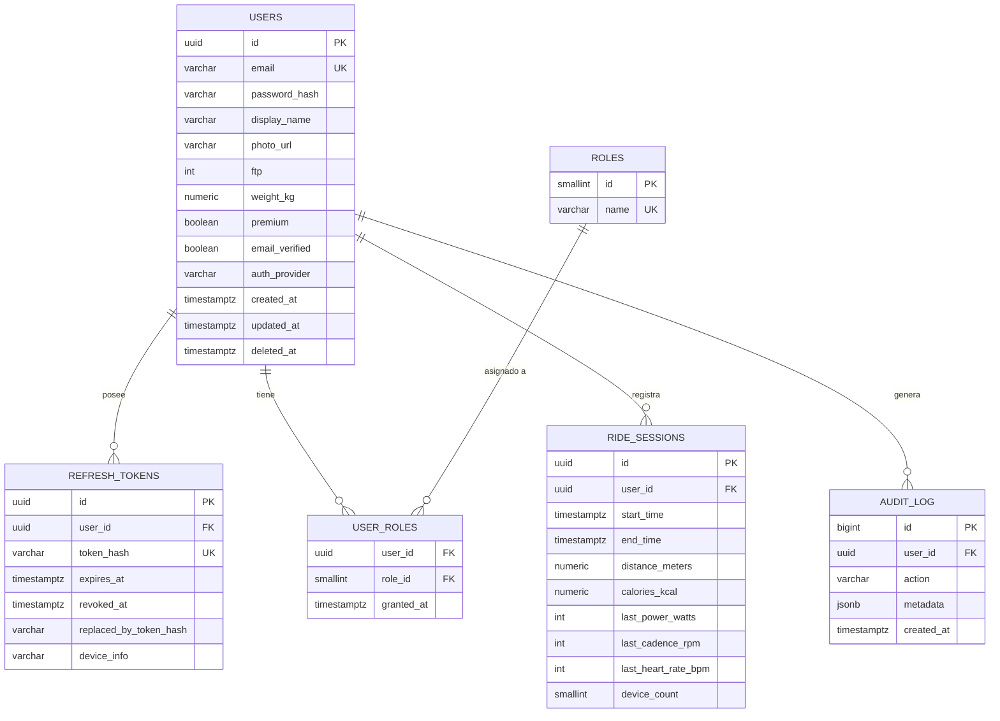
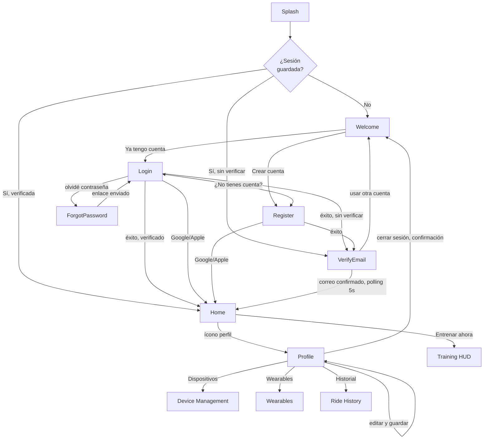
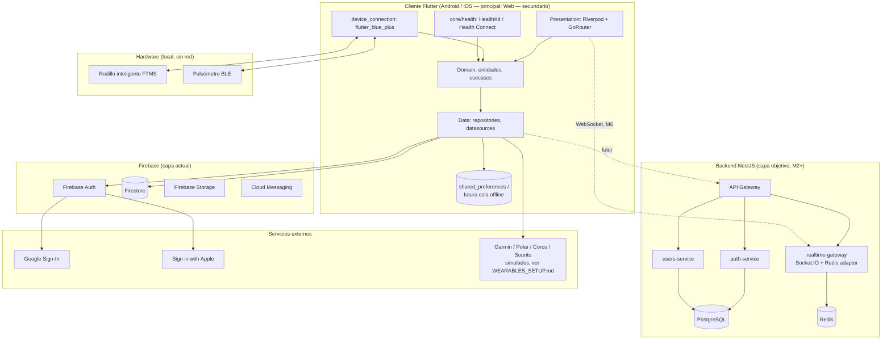

# Especificación Técnica — Módulos M0/M1 (Fundamentos + Autenticación)

**Nivel:** producción/empresarial · **Estado:** M0 y M1 ya implementados en el
cliente Flutter (ver `README.md`); este documento formaliza el contrato
completo (API, datos, seguridad, tiempo real, offline) para que el
desarrollo posterior sea sólido sobre una base ya especificada, no
improvisada módulo a módulo.

---

## 0. Nota de reconciliación arquitectónica (léase primero)

El cliente Flutter de M1 **ya está implementado** hablando directamente con
**Firebase Auth + Firestore** (`AuthRemoteDataSourceImpl`), sin backend
propio — fue la decisión pragmática para llegar rápido a una demo
funcional. Este documento define **dos capas**, no una:

1. **Capa actual (Firestore)** — el esquema y las reglas de seguridad que
   gobiernan la app HOY. Es autoritativa para M0/M1 tal como están
   desplegados.
2. **Capa objetivo (NestJS + PostgreSQL)** — el backend de producción ya
   esbozado en el documento de arquitectura general (`documento-tecnico...`),
   necesario a partir de M2+ para: telemetría BLE agregada de todos los
   usuarios (analítica, no solo local), multijugador (estado compartido de
   baja latencia, imposible de modelar bien en Firestore), panel de
   administración con consultas complejas, y portabilidad fuera del
   ecosistema Firebase si el negocio lo exige más adelante.

Los contratos de API de este documento se especifican para **ambas
capas** donde aplica — la capa Firestore documentada como lo que el
cliente ya consume (vía SDK, no HTTP directo, pero con el mismo contrato de
datos), y la capa NestJS documentada como el contrato objetivo al que
migrar cuando el roadmap (sección 10) lo indique.

---

## 1. Contratos de API

### 1.1 Capa Firestore (actual) — contrato de datos consumido vía SDK

El cliente no llama a un REST propio; llama al SDK de Firebase, que por
debajo sí es HTTP/gRPC contra la API de Firebase. El "contrato" aquí es la
forma de los documentos y las operaciones permitidas, no rutas HTTP:

| Operación | SDK usado | Documento/colección | Reglas de acceso |
|---|---|---|---|
| Registro | `FirebaseAuth.createUserWithEmailAndPassword` | — | Público |
| Login | `FirebaseAuth.signInWithEmailAndPassword` | — | Público |
| Login social | `FirebaseAuth.signInWithCredential` | — | Público |
| Reset contraseña | `FirebaseAuth.sendPasswordResetEmail` | — | Público (rate-limited por Firebase) |
| Verificación email | `User.sendEmailVerification` / `User.reload` | — | Requiere sesión |
| Leer perfil | `Firestore.collection('users').doc(uid).get()` | `users/{uid}` | Solo el propio `uid` (ver 5.4) |
| Actualizar perfil | `Firestore...set(merge:true)` | `users/{uid}` | Solo el propio `uid` |
| Guardar sesión | `Firestore...collection('ride_sessions').add()` | `users/{uid}/ride_sessions/{id}` | Solo el propio `uid` |
| Leer historial | `Firestore...collection('ride_sessions').orderBy('startTime','desc').limit(30).snapshots()` | `users/{uid}/ride_sessions` | Solo el propio `uid` |

### 1.2 Capa NestJS objetivo (`auth-service` + `users-service`) — REST

Base URL: `https://api.ridepro.app/v1` · Todas las respuestas de error
siguen el mismo sobre:

```json
{
  "error": {
    "code": "AUTH_INVALID_CREDENTIALS",
    "message": "Correo o contraseña incorrectos.",
    "requestId": "8f3e1c2a-...",
    "details": null
  }
}
```

#### `POST /auth/register`

| | |
|---|---|
| Auth | Ninguna |
| Rate limit | 5 req / 15 min / IP |

Request:
```json
{
  "email": "rider@ridepro.com",
  "password": "Abcdefg1",
  "displayName": "Rider"
}
```
Response `201 Created`:
```json
{
  "userId": "usr_9f2a...",
  "email": "rider@ridepro.com",
  "emailVerified": false,
  "accessToken": "eyJhbGciOi...",
  "refreshToken": "rt_8c1d...",
  "expiresIn": 3600
}
```
Errores: `400 VALIDATION_ERROR` (password fuera de política), `409 EMAIL_ALREADY_EXISTS`.

#### `POST /auth/login`

Request: `{ "email": string, "password": string }`
Response `200`: igual forma que register (sin `displayName`).
Errores: `401 AUTH_INVALID_CREDENTIALS`, `403 AUTH_EMAIL_NOT_VERIFIED` (si se decide bloquear login sin verificar, configurable), `429 RATE_LIMITED`.

#### `POST /auth/social/google` / `POST /auth/social/apple`

Request: `{ "idToken": string }` (token del SDK nativo de Google/Apple, verificado server-side contra el emisor correspondiente).
Response `200`: igual forma que login. `emailVerified` siempre `true` para estos proveedores.
Errores: `401 AUTH_INVALID_SOCIAL_TOKEN`.

#### `POST /auth/refresh`

| | |
|---|---|
| Auth | Ninguna (el refresh token ES la credencial) |
| Rate limit | 20 req / 15 min / token |

Request: `{ "refreshToken": string }`
Response `200`: `{ "accessToken": string, "refreshToken": string, "expiresIn": 3600 }`
— **rotación obligatoria**: el refresh token usado se invalida y se emite
uno nuevo (ver 5.2). Errores: `401 REFRESH_TOKEN_INVALID_OR_REUSED`.

#### `POST /auth/logout`

Auth: Bearer access token. Request: `{ "refreshToken": string }` (se
revoca explícitamente). Response `204`.

#### `POST /auth/password-reset/request`

Request: `{ "email": string }`. Response `202` SIEMPRE (nunca revela si el
correo existe — mitigación de enumeración de usuarios, ver 5.5).

#### `POST /auth/password-reset/confirm`

Request: `{ "token": string, "newPassword": string }`. Response `204`.
Errores: `400 RESET_TOKEN_EXPIRED_OR_INVALID`.

#### `POST /auth/email/verify`

Request: `{ "token": string }`. Response `204`. Errores: `400 VERIFICATION_TOKEN_EXPIRED_OR_INVALID`.

#### `GET /users/me`

Auth: Bearer. Response `200`:
```json
{
  "id": "usr_9f2a...",
  "email": "rider@ridepro.com",
  "displayName": "Rider",
  "photoUrl": null,
  "ftp": 250,
  "weightKg": 70.5,
  "premium": false,
  "role": "user",
  "createdAt": "2026-01-10T08:00:00Z"
}
```

#### `PATCH /users/me`

Auth: Bearer. Request (todos los campos opcionales):
```json
{ "displayName": "Rider Pro", "ftp": 260, "weightKg": 71.0 }
```
Response `200`: el objeto de usuario actualizado. Errores: `400 VALIDATION_ERROR`.

#### `DELETE /users/me`

Auth: Bearer + `confirm: true` en el body (doble confirmación explícita
por ser destructivo). Response `202` (borrado asíncrono, ver 5.6 sobre
derecho al olvido/GDPR). Efecto: revoca todos los refresh tokens del
usuario de inmediato, el borrado de datos ocurre en un job en segundo plano.

### 1.3 Contrato WebSocket (objetivo, base para M2+ tiempo real)

Namespace: `wss://api.ridepro.app/v1/realtime`

**Handshake:** el cliente conecta con `Authorization: Bearer <accessToken>`
en el header de conexión (no en query string, para no dejarlo en logs de
acceso). El gateway valida el JWT antes de aceptar el upgrade — una
conexión con token inválido/expirado se rechaza con código de cierre
`4401`, nunca se acepta y se cierra después.

| Evento (cliente→servidor) | Payload | Cuándo se emite |
|---|---|---|
| `session:start` | `{ sessionId, routeId? }` | Al iniciar el HUD (M2) |
| `telemetry:push` | `{ sessionId, speedKmh?, powerWatts?, cadenceRpm?, heartRateBpm?, ts }` | ~1 vez/segundo mientras hay datos BLE |
| `session:pause` / `session:resume` | `{ sessionId }` | Botones de pausa del HUD |
| `session:finish` | `{ sessionId, summary }` | Al finalizar |

| Evento (servidor→cliente) | Payload | Cuándo se emite |
|---|---|---|
| `session:ack` | `{ sessionId, serverTime }` | Confirmación de `session:start` |
| `telemetry:broadcast` | `{ sessionId, participants: [...] }` | Solo en salas multijugador (M6) — en M2 (entrenamiento libre en solitario) este evento no se usa |
| `error` | `{ code, message }` | Cualquier fallo de procesamiento |

Heartbeat: ping cada 25s, el servidor cierra conexiones sin pong en 60s.
Reconexión: backoff exponencial idéntico en espíritu al ya implementado
para BLE (`_handleUnexpectedDisconnect` en `ble_datasource.dart`) — 2s,
4s, 8s... hasta 30s de techo, con reenvío del último `telemetry:push` no
confirmado al reconectar.

---

## 2. Esquema de base de datos

### 2.1 Capa Firestore (actual)

```
users/{uid}                              [documento]
  ├─ email: string
  ├─ displayName: string
  ├─ photoUrl: string | null
  ├─ ftp: number | null
  ├─ weightKg: number | null
  ├─ premium: boolean (default false)
  ├─ role: string ("user" | "premium" | "coach" | "admin", default "user")  ← añadir en tarea de roadmap #3
  └─ ride_sessions/{sessionId}           [subcolección]
       ├─ startTime: timestamp
       ├─ endTime: timestamp
       ├─ distanceMeters: number
       ├─ caloriesKcal: number
       ├─ lastPowerWatts: number | null
       ├─ lastCadenceRpm: number | null
       ├─ lastHeartRateBpm: number | null
       └─ deviceCount: number
```

**Restricciones** (Firestore Security Rules — ver 5.4 para el archivo
completo): un documento `users/{uid}` solo es legible/escribible por el
usuario autenticado con ese mismo `uid`; el campo `role` y `premium` deben
ser de solo lectura para el cliente (solo un backend/Cloud Function con
privilegios admin puede escribirlos, para que un usuario nunca pueda
auto-otorgarse `premium: true` editando su propio documento).

**Índices compuestos requeridos** (`firestore.indexes.json`):
```json
{
  "indexes": [
    {
      "collectionGroup": "ride_sessions",
      "queryScope": "COLLECTION",
      "fields": [{ "fieldPath": "startTime", "order": "DESCENDING" }]
    }
  ]
}
```
(Firestore genera automáticamente el índice simple de `startTime`; se
declara explícitamente aquí para que quede versionado en el repositorio
en vez de depender de que alguien lo cree manualmente desde la consola.)

**Migraciones en Firestore:** al no tener schema rígido, una "migración"
es un script único (Cloud Function ejecutada manualmente o Admin SDK
script) que recorre documentos existentes y añade campos nuevos con su
valor por defecto — p. ej. la tarea de roadmap #3 (añadir `role`) requiere
un script de backfill que ponga `role: "user"` en todos los documentos
`users/*` que no lo tengan, ANTES de desplegar código cliente que asuma
que el campo siempre existe.

### 2.2 Capa PostgreSQL (objetivo — backend NestJS)



**DDL completo** (`migrations/0001_init.sql`, convención de nombre
`{secuencia}_{descripcion}.sql`, aplicadas con una herramienta de
migraciones versionadas tipo `node-pg-migrate`/Prisma Migrate — nunca
`synchronize: true` de TypeORM en producción, precisamente para que cada
cambio de esquema quede versionado y revisable):

```sql
-- 0001_init.sql
CREATE EXTENSION IF NOT EXISTS pgcrypto; -- para gen_random_uuid()

CREATE TABLE users (
    id              UUID PRIMARY KEY DEFAULT gen_random_uuid(),
    email           VARCHAR(255) NOT NULL,
    password_hash   VARCHAR(255),         -- NULL si el usuario solo usa login social
    display_name    VARCHAR(100) NOT NULL DEFAULT '',
    photo_url       VARCHAR(500),
    ftp             SMALLINT CHECK (ftp IS NULL OR ftp BETWEEN 0 AND 1000),
    weight_kg       NUMERIC(5,2) CHECK (weight_kg IS NULL OR weight_kg BETWEEN 20 AND 300),
    premium         BOOLEAN NOT NULL DEFAULT FALSE,
    email_verified  BOOLEAN NOT NULL DEFAULT FALSE,
    auth_provider   VARCHAR(20) NOT NULL DEFAULT 'password'
                    CHECK (auth_provider IN ('password', 'google', 'apple')),
    created_at      TIMESTAMPTZ NOT NULL DEFAULT now(),
    updated_at      TIMESTAMPTZ NOT NULL DEFAULT now(),
    deleted_at      TIMESTAMPTZ,          -- soft delete (ver 5.6, derecho al olvido)
    CONSTRAINT users_email_unique UNIQUE (email)
);
CREATE INDEX idx_users_email_lower ON users (LOWER(email));
-- Índice parcial: acelera la query más común del panel admin ("usuarios
-- premium activos") sin cargar el índice con usuarios free/borrados.
CREATE INDEX idx_users_premium_active ON users (premium) WHERE deleted_at IS NULL AND premium = TRUE;

CREATE TABLE roles (
    id      SMALLINT PRIMARY KEY,
    name    VARCHAR(20) NOT NULL UNIQUE
);
INSERT INTO roles (id, name) VALUES (1, 'user'), (2, 'premium'), (3, 'coach'), (4, 'admin');

CREATE TABLE user_roles (
    user_id     UUID NOT NULL REFERENCES users(id) ON DELETE CASCADE,
    role_id     SMALLINT NOT NULL REFERENCES roles(id),
    granted_at  TIMESTAMPTZ NOT NULL DEFAULT now(),
    PRIMARY KEY (user_id, role_id)
);

CREATE TABLE refresh_tokens (
    id                      UUID PRIMARY KEY DEFAULT gen_random_uuid(),
    user_id                 UUID NOT NULL REFERENCES users(id) ON DELETE CASCADE,
    -- Se guarda el HASH del token (SHA-256), nunca el token en claro —
    -- si la tabla se filtra, no expone credenciales de sesión utilizables.
    token_hash              VARCHAR(64) NOT NULL,
    expires_at              TIMESTAMPTZ NOT NULL,
    revoked_at              TIMESTAMPTZ,
    replaced_by_token_hash  VARCHAR(64), -- cadena de rotación, ver 5.2
    device_info             VARCHAR(255),
    created_at              TIMESTAMPTZ NOT NULL DEFAULT now(),
    CONSTRAINT refresh_tokens_hash_unique UNIQUE (token_hash)
);
CREATE INDEX idx_refresh_tokens_user_active ON refresh_tokens (user_id) WHERE revoked_at IS NULL;

CREATE TABLE ride_sessions (
    id                  UUID PRIMARY KEY DEFAULT gen_random_uuid(),
    user_id             UUID NOT NULL REFERENCES users(id) ON DELETE CASCADE,
    start_time          TIMESTAMPTZ NOT NULL,
    end_time            TIMESTAMPTZ NOT NULL CHECK (end_time > start_time),
    distance_meters     NUMERIC(10,2) NOT NULL DEFAULT 0,
    calories_kcal       NUMERIC(8,2) NOT NULL DEFAULT 0,
    last_power_watts    SMALLINT,
    last_cadence_rpm    SMALLINT,
    last_heart_rate_bpm SMALLINT,
    device_count        SMALLINT NOT NULL DEFAULT 0,
    created_at          TIMESTAMPTZ NOT NULL DEFAULT now()
);
-- La query más común del historial: "mis últimas N sesiones" ordenadas.
CREATE INDEX idx_ride_sessions_user_start ON ride_sessions (user_id, start_time DESC);

CREATE TABLE audit_log (
    id          BIGSERIAL PRIMARY KEY,
    user_id     UUID REFERENCES users(id) ON DELETE SET NULL,
    action      VARCHAR(50) NOT NULL, -- 'login', 'role_change', 'account_deleted', ...
    metadata    JSONB,
    created_at  TIMESTAMPTZ NOT NULL DEFAULT now()
);
CREATE INDEX idx_audit_log_user ON audit_log (user_id, created_at DESC);
```

**Restricciones destacadas y su porqué:**
- `end_time > start_time` a nivel de CHECK, no solo validado en la app —
  una fila corrupta no debería poder existir aunque un bug de cliente lo
  permita.
- `token_hash` en vez del token en claro — principio de menor exposición
  ante una fuga de base de datos.
- Soft delete (`deleted_at`) en `users` en vez de `DELETE` físico
  inmediato — permite cumplir con "el usuario pidió borrar su cuenta" sin
  perder integridad referencial de un día para otro; el borrado físico
  real ocurre en un job programado 30 días después (periodo de gracia
  estándar de la industria para arrepentimiento/recuperación de cuenta).

---

## 3. Wireframes M0/M1 y flujo de navegación

Representación en texto (no hay herramienta de diseño gráfico en este
entorno) — corresponde exactamente a las pantallas ya implementadas en
`features/auth/presentation/pages/` y `features/home/`, `features/profile/`.

### 3.1 Flujo completo de navegación



### 3.2 Wireframes por pantalla

```
┌─── Welcome ────────────────┐   ┌─── Login ───────────────────┐
│                             │   │  ← (sin flecha, es raíz)     │
│         [ícono bici]        │   │  Bienvenido de nuevo         │
│                             │   │  Inicia sesión para...       │
│   Entrena como nunca antes  │   │                              │
│   Rutas reales, multi-      │   │  [Correo electrónico    ]    │
│   jugador, IA...             │   │  [Contraseña        👁]    │
│                             │   │              ¿Olvidaste...?  │
│  ┌─────────────────────┐   │   │  [   Iniciar sesión   ]     │
│  │   Crear cuenta        │   │   │  ──────── o ────────         │
│  └─────────────────────┘   │   │  [ Continuar con Google ]    │
│  ┌─────────────────────┐   │   │  [ Continuar con Apple  ]*   │
│  │  Ya tengo cuenta      │   │   │  ¿No tienes cuenta? Crear    │
│  └─────────────────────┘   │   │  * solo iOS                  │
└─────────────────────────────┘   └───────────────────────────────┘

┌─── Register ────────────────┐  ┌─── Verify Email ────────────┐
│  ←  Crea tu cuenta           │  │        [ícono sobre]         │
│                              │  │      Verifica tu correo       │
│  [Nombre               ]     │  │  Enviamos un enlace a         │
│  [Correo electrónico   ]     │  │  rider@ridepro.com            │
│  [Contraseña        👁]     │  │                               │
│  [Confirmar contraseña ]     │  │  [  Ya verifiqué mi correo ]  │
│  [    Registrarme     ]     │  │  [  Reenviar correo (30s)  ]  │
│  Al registrarte aceptas...   │  │       Usar otra cuenta        │
│  ──────── o ────────          │  └───────────────────────────────┘
│  [ Continuar con Google ]    │
│  [ Continuar con Apple  ]*   │
└──────────────────────────────┘

┌─── Home ─────────────────────┐  ┌─── Profile ──────────────────┐
│  RidePro      👤  🚪         │  │  ← Mi perfil                  │
│                               │  │        (avatar) Cambiar foto  │
│  Hola, Rider                  │  │  [Nombre              ]      │
│  ┌─────────────────────┐    │  │  [Correo (deshabilitado)]     │
│  │ Tu sesión de hoy      │    │  │  [FTP  ] [Peso        ]      │
│  │ (plan IA — próximam.) │    │  │  [  Guardar cambios   ]      │
│  └─────────────────────┘    │  │  Dispositivos conectados  >   │
│  ┌─────────────────────┐    │  │  Wearables                >  │
│  │ Rutas recomendadas    │    │  │  Historial entrenamientos >  │
│  │ (catálogo — M4)       │    │  │  Cuenta                       │
│  └─────────────────────┘    │  │  Cerrar sesión                │
│         ⊕ Entrenar ahora     │  │                               │
└───────────────────────────────┘  └───────────────────────────────┘
```

**Nota de proceso:** estos wireframes ASCII documentan la estructura y
jerarquía ya construida — para handoff a un diseñador visual, exportar
este flujo a Figma usando esta misma jerarquía de pantallas/estados como
punto de partida, no como sustituto de un diseño visual real.

---

## 4. Modelo de permisos y roles

Cuatro roles, no mutuamente excluyentes en cuanto a jerarquía de acceso
(un `admin` puede hacer todo lo que un `coach`, etc. — jerarquía aditiva):

| Capacidad | Usuario | Premium | Entrenador (Coach) | Admin |
|---|---|---|---|---|
| Entrenar (BLE, HUD libre) | ✅ | ✅ | ✅ | ✅ |
| Historial propio | ✅ | ✅ | ✅ | ✅ |
| Catálogo de rutas completo (M4) | Limitado | ✅ | ✅ | ✅ |
| Plan de entrenamiento IA (M9) | ❌ | ✅ | ✅ | ✅ |
| Ver historial de sus atletas asignados | ❌ | ❌ | ✅ | ✅ |
| Crear/asignar planes a atletas | ❌ | ❌ | ✅ | ✅ |
| Panel de administración | ❌ | ❌ | ❌ | ✅ |
| Gestionar roles de otros usuarios | ❌ | ❌ | ❌ | ✅ |
| Moderar contenido/reportes | ❌ | ❌ | ❌ | ✅ |

**Dónde vive el rol, en cada capa:**
- **Firestore (actual):** campo `role` en `users/{uid}` — de solo lectura
  para el cliente (ver regla en 5.4); solo una Cloud Function con
  credenciales admin puede cambiarlo. El campo `premium` es, en la
  práctica, redundante con `role: "premium"` — tarea de roadmap: unificar
  en un único campo `role` para no tener dos fuentes de verdad del mismo
  concepto.
- **PostgreSQL (objetivo):** tabla `user_roles` (relación N:N con
  `roles`) en vez de una columna única — permite que un usuario acumule
  varios roles a la vez sin conflicto (p. ej. `premium` + `coach`
  simultáneamente), algo que un único campo enum no modelaría bien.

**Propagación del cambio de rol — la parte que más falla en la práctica:**
- Firebase: los *custom claims* (si se usan en vez de leer Firestore en
  cada request) solo se reflejan en el ID token tras un refresh — que
  ocurre automáticamente cada hora, o se puede forzar con
  `user.getIdToken(true)` inmediatamente después de que un admin cambie
  el rol, para que la UI (p. ej. desbloquear el catálogo premium) no
  tarde hasta una hora en reflejar el cambio.
- PostgreSQL/NestJS: el JWT propio incluye los roles en el payload en el
  momento de emitirlo — un cambio de rol NO se refleja hasta el próximo
  `refresh` (ver 5.2); si se necesita revocación instantánea (p. ej. un
  admin banea a un usuario), hay que consultar una lista de revocación
  además de confiar en el JWT (ver 5.3).

---

## 5. Modelo de seguridad

### 5.1 Estructura del JWT

**Firebase ID Token** (actual, ya emitido por el SDK — no se genera a
mano): JWT estándar RS256, firmado por Google, contiene `sub` (uid),
`email`, `email_verified`, `firebase.sign_in_provider`, expira a los 60
minutos, renovado automáticamente por el SDK.

**JWT propio del backend NestJS (objetivo):**
```json
{
  "sub": "usr_9f2a...",
  "roles": ["user", "premium"],
  "email_verified": true,
  "iat": 1768900000,
  "exp": 1768903600,
  "iss": "https://api.ridepro.app",
  "aud": "ridepro-mobile"
}
```
Firmado con **RS256** (par de claves asimétrico), no HS256 — así el
`accessToken` puede ser verificado por cualquier microservicio (gateway,
session-service, billing-service) con la clave PÚBLICA, sin que cada uno
necesite el secreto de firma, reduciendo la superficie si un servicio se
ve comprometido.

### 5.2 Refresh tokens — rotación obligatoria

Cada `POST /auth/refresh` exitoso:
1. Verifica que el `refreshToken` recibido existe en `refresh_tokens`,
   no está `revoked_at`, y no expiró.
2. Marca el token usado como `revoked_at = now()`.
3. Emite un `accessToken` Y un `refreshToken` NUEVOS; guarda
   `replaced_by_token_hash` en la fila vieja, apuntando a la nueva.
4. **Detección de reuso:** si llega un `refreshToken` que ya tiene
   `revoked_at` seteado (alguien intentó reusar uno viejo — señal de
   robo/fuga), se revocan TODOS los refresh tokens activos de ese
   usuario de inmediato y se fuerza reautenticación completa. Es la
   defensa estándar contra un refresh token robado y reutilizado en
   paralelo al legítimo.

### 5.3 OAuth (Google/Apple)

Ya implementado en el cliente (ver `SETUP_SOCIAL_LOGIN.md`). En la capa
NestJS objetivo, el backend NUNCA confía ciegamente en el `idToken` que
manda el cliente: lo reverifica server-side contra el emisor (`accounts.google.com`
/ `appleid.apple.com`), comprobando firma, audiencia (`aud` debe coincidir
con el Client ID de la app) y expiración — replicando la validación que
Firebase Auth ya hace por debajo hoy.

### 5.4 Reglas de seguridad de Firestore

> ⚠️ **Nota de auditoría (ver `docs/SECURITY_AUDIT.md`):** la versión de
> esta regla que apareció originalmente en este documento tenía una
> vulnerabilidad crítica de escalada de privilegios — la regla de
> `create` no validaba el contenido del documento, solo quién podía
> crearlo, permitiendo que cualquier usuario se auto-asignara
> `role: "admin"` en su primer login. Corregido; el snippet de abajo
> refleja la versión ya corregida. El archivo real y autoritativo vive en
> `firestore.rules` (raíz del proyecto) — este bloque es una copia de
> referencia para lectura, no la fuente de verdad; si divergen, gana el
> archivo real.

```
rules_version = '2';
service cloud.firestore {
  match /databases/{database}/documents {

    function isOwner(uid) {
      return request.auth != null && request.auth.uid == uid;
    }

    function protectedFields() {
      return ['role', 'permissions', 'subscription', 'isAdmin', 'customClaims', 'premium'];
    }

    match /users/{uid} {
      allow read: if isOwner(uid);

      // La creación también valida CONTENIDO, no solo autoría: los
      // campos sin valor por defecto seguro quedan prohibidos por
      // completo, y los que sí tienen uno (role, premium) solo se
      // aceptan si es exactamente ese valor seguro.
      allow create: if isOwner(uid) && _hasSafeDefaultsOnCreate(request.resource.data);

      allow update: if isOwner(uid)
                    && !request.resource.data.diff(resource.data)
                        .affectedKeys()
                        .hasAny(protectedFields());

      allow delete: if false; // soft delete vía Cloud Function, nunca directo

      match /ride_sessions/{sessionId} {
        allow read: if isOwner(uid);
        allow create: if isOwner(uid);
        allow update, delete: if false; // append-only
      }
    }

    match /{document=**} {
      allow read, write: if false; // denegar por defecto cualquier colección no listada arriba
    }

    function _hasSafeDefaultsOnCreate(data) {
      let noDefaultAllowed = ['permissions', 'subscription', 'isAdmin', 'customClaims'];
      return !data.keys().hasAny(noDefaultAllowed)
             && (!('role' in data) || data.role == 'user')
             && (!('premium' in data) || data.premium == false);
    }
  }
}
```

Tests de seguridad automatizados contra esta regla:
`firebase/rules-tests/firestore.rules.test.js` — ver `docs/SECURITY_AUDIT.md`
sección 7-8 para cobertura y estado de verificación.

### 5.5 Otras medidas de seguridad transversales

- **Cifrado en tránsito:** TLS 1.2+ obligatorio en todos los endpoints
  (Firebase lo impone por defecto; el backend NestJS objetivo debe
  rechazar HTTP plano incluso en desarrollo, para no acostumbrar al
  equipo a probar sin TLS).
- **Cifrado en reposo:** Firestore cifra en reposo por defecto (gestionado
  por Google); en PostgreSQL, habilitar cifrado a nivel de disco
  (managed, p. ej. RDS/Cloud SQL con cifrado activado) más, si se
  almacenara algún dato especialmente sensible en el futuro, cifrado a
  nivel de columna con `pgcrypto`.
- **Enumeración de usuarios:** `password-reset/request` responde
  `202 Accepted` SIEMPRE, exista o no el correo — nunca `404` que
  confirmaría la existencia de una cuenta.
- **Rate limiting:** por IP en endpoints públicos (`register`, `login`,
  `password-reset`) y por token en `refresh` — mitiga fuerza bruta y
  scraping de cuentas.
- **Gestión de secretos:** ninguna credencial en código fuente — ya es el
  patrón establecido en el proyecto (`SocialLoginConfig`,
  `google-services.json`/`GoogleService-Info.plist` como placeholders
  reemplazables). El backend objetivo debe seguir el mismo principio vía
  variables de entorno/secret manager, nunca `.env` commiteado.
- **Política de contraseñas:** ya implementada en el cliente
  (`Validators.password` — 8+ caracteres, mayúscula, número); el backend
  debe validar la MISMA política server-side, nunca confiar solo en la
  validación de UI.
- **Derecho al olvido (GDPR/CCPA-friendly):** `DELETE /users/me` con soft
  delete de 30 días (ver 2.2) — durante ese periodo, el usuario puede
  contactar soporte para revertir; pasado ese plazo, un job purga
  físicamente sus filas relacionadas.

---

## 6. Arquitectura de sincronización en tiempo real

Hay que distinguir dos "tiempos reales" completamente distintos, que NO
deben resolverse con la misma tecnología:

### 6.1 Dispositivo BLE → App (ya implementado, local, sin red)

Rodillo/sensor → `flutter_blue_plus` → `BleDataSource` → parsers →
`TelemetryAggregator` → UI. Todo ocurre **en el propio teléfono**, sin
ningún servidor de por medio — es la razón por la que el HUD funciona sin
conexión a internet. Ninguna arquitectura de tiempo real de backend
aplica aquí; ya está resuelto y documentado en `BLE_PERMISSIONS.md` y el
propio código de `device_connection`.

### 6.2 App → Backend / App → App (pendiente, requiere servidor)

Esto sí necesita diseño: cuándo una sesión de un usuario debe verse en
"tiempo real" desde OTRO lugar (el móvil de un rival en una carrera
multijugador M6, o el dashboard de un coach viendo a su atleta en vivo).

**Opción A — WebSocket propio (Socket.IO sobre NestJS).**
- Pros: control total de la lógica de sala, escalable horizontalmente con
  el adapter de Redis (`socket.io-redis-adapter`), ya es el patrón
  descrito en la arquitectura general para multijugador.
- Contras: hay que construirlo y operarlo (más infraestructura).
- Cuándo usarla: **multijugador (M6)** — necesita lógica de sala,
  ranking en vivo, validación anti-cheat en servidor; un simple listener
  de base de datos no alcanza.

**Opción B — Firestore realtime listeners (`snapshots()`).**
- Pros: cero infraestructura adicional, ya se usa en el proyecto (p. ej.
  el propio historial de sesiones usa `snapshots()`), seguridad declarada
  con las mismas reglas de Firestore.
- Contras: no apto para actualizaciones de muy alta frecuencia con muchos
  suscriptores a la vez (coste por documento leído escala con
  suscriptores × frecuencia de cambio — cara a partir de cierto volumen),
  y no permite lógica de servidor en el camino (validación, anti-cheat).
- Cuándo usarla: **dashboard de coach viendo UN atleta** (baja
  cardinalidad de suscriptores) — escribir `telemetry` cada pocos
  segundos (no cada notificación BLE de 1Hz, para no disparar el coste)
  a un documento `live_sessions/{sessionId}` que el coach escucha.

**Recomendación:** Opción B para "coach viendo a un atleta" (M7-ish,
bajo volumen, cero infra nueva); Opción A reservada exclusivamente para
multijugador (M6, alto volumen y necesidad real de lógica de servidor).
No construir el WebSocket completo antes de necesitarlo de verdad —
sería infraestructura ociosa hasta M6.

---

## 7. Estrategia Offline-First

### 7.1 Qué ya está resuelto "gratis" y qué no

`cloud_firestore` soporta persistencia offline nativa (caché local + cola
de escrituras pendientes que se reintentan solas al recuperar conexión)
con **una sola línea de configuración**, hoy no habilitada:

```dart
// En main.dart, antes de cualquier lectura/escritura:
FirebaseFirestore.instance.settings = const Settings(
  persistenceEnabled: true,
  cacheSizeBytes: Settings.CACHE_SIZE_UNLIMITED,
);
```

Con esto, `saveSession()` (usado hoy en `RideSessionRepositoryImpl`) deja
de fallar visiblemente sin conexión: Firestore encola la escritura
localmente y la sincroniza sola al reconectar — el ícono "no se pudo
guardar" de `SessionSummaryPage` pasaría a ser un caso mucho más raro
(solo errores reales de permisos/validación, no de conectividad).
**Esta es la tarea #1 del roadmap (sección 10) por su relación
costo/beneficio.**

### 7.2 Lo que Firestore NO resuelve solo

- **Autenticación offline inicial:** un usuario que nunca inició sesión
  con conexión no puede autenticarse la primera vez sin red (obvio, pero
  hay que comunicarlo bien en la UI — mensaje claro de "necesitas
  conexión para iniciar sesión", no un spinner infinito).
- **Conflictos de escritura concurrente en el mismo campo** desde dos
  dispositivos del mismo usuario mientras ambos estaban offline:
  Firestore aplica **last-write-wins** por defecto a nivel de documento
  completo (no merge de campos individuales entre escrituras offline
  concurrentes de dos clientes distintos) — aceptable para `ride_sessions`
  (inmutables una vez creadas, nunca se editan) pero hay que tenerlo en
  cuenta si en el futuro se permite editar el perfil desde dos
  dispositivos a la vez.
- **BLE mientras hay una escritura pendiente:** el `TelemetryAggregator`
  vive en memoria durante la sesión — si la app se cierra a mitad de una
  sesión sin conexión, la sesión en curso se pierde (no hay checkpoint
  local todavía). Mejora propuesta: persistir un snapshot de
  `RideSessionState` en `shared_preferences` cada N segundos durante una
  sesión activa, para poder recuperarla si la app se cierra
  inesperadamente — pendiente en el roadmap de M2, no M0/M1.

### 7.3 Cola de sincronización genérica (para datos que NO son Firestore)

Para cualquier escritura futura que no pase por Firestore directamente
(p. ej. si se integra el backend NestJS objetivo para ciertas
operaciones), el patrón recomendado es una tabla local (`sqflite`/`drift`)
`pending_writes(id, endpoint, payload_json, created_at, retry_count)`: un
`ConnectivityWorker` (usando el ya presente `connectivity_plus`) escucha
cambios de conectividad y, al pasar de offline→online, procesa la cola en
orden con el mismo backoff exponencial ya usado en dos lugares distintos
del proyecto (reconexión BLE, reconexión de dispositivos wearables) —
reutilizar ese mismo patrón aquí por consistencia, no inventar un tercero.

---

## 8. Diagrama de arquitectura completo



---

## 9. Cuellos de botella identificados y soluciones propuestas

| # | Cuello de botella | Por qué ocurre | Solución propuesta | Cuándo atender |
|---|---|---|---|---|
| 1 | Escrituras a Firestore fallan visiblemente sin conexión | `persistenceEnabled` no está activado (ver 7.1) | Una línea de configuración — ya especificado arriba | **Ahora** (roadmap #1) |
| 2 | Cambio de rol tarda hasta 1h en reflejarse | Custom claims/JWT no se refrescan solos | Forzar `getIdToken(true)` tras cambio de rol vía Cloud Function trigger que notifica al cliente (FCM) para que refresque | Antes de lanzar planes premium (M9) |
| 3 | Coste de Firestore crece con el historial de sesiones a escala | Cada lectura de `ride_sessions` cuenta por documento; usuarios con miles de sesiones acumulan coste | Paginar (`limit` + cursores, ya se usa `limit(30)`) y, pasado cierto volumen por usuario, mover agregados históricos a PostgreSQL (M3) dejando Firestore solo para lo reciente | M3 (Estadísticas) |
| 4 | Un solo `GetIt` global como service locator puede volverse difícil de testear a medida que crecen los módulos | DI manual centralizada (decisión documentada en `injection.dart`) | Ya mitigado en parte (cada test usa mocks/fakes inyectados vía constructor, no vía `sl()`); si el dolor crece, migrar a `injectable` + `build_runner` (ya está como dependencia lista, ver README) | Cuando el archivo `injection.dart` supere ~300 líneas legibles con dificultad |
| 5 | Reconexión BLE agresiva puede drenar batería en sesiones largas con señal inestable | Backoff con techo de 30s sigue reintentando indefinidamente mientras `isAutoReconnectEnabled` | Añadir un límite de tiempo total de reintento (no solo de intentos) tras el cual se notifica al usuario en vez de seguir en silencio | M2 (HUD ya construido, revisar antes de sesiones largas de ciclismo real) |
| 6 | WebSocket de multijugador no escala más allá de una instancia sin trabajo adicional | Socket.IO por defecto no comparte estado entre instancias del servidor | Adapter de Redis Pub/Sub (`socket.io-redis-adapter`) — ya identificado en la arquitectura general, debe implementarse ANTES de M6, no durante | Antes de M6 |
| 7 | Ambigüedad de permisos de HealthKit en iOS (no se puede saber con certeza si el usuario denegó lectura) | Limitación de privacidad de Apple, no de esta app (documentado en `HEALTH_SETUP.md`) | Ya mitigado con degradación silenciosa (lista vacía en vez de error) — riesgo residual: usuarios que denegaron pueden no entender por qué no ven datos. Mejora futura: mensaje contextual la primera vez que `fetchActivities()` devuelve vacío repetidamente | Bajo, monitorear feedback de usuarios reales |
| 8 | Reglas de seguridad de Firestore se vuelven difíciles de auditar a medida que crecen los roles/colecciones | Las reglas actuales son simples porque el modelo de datos aún es simple | Adoptar el emulador de Firestore + tests automatizados de reglas (`@firebase/rules-unit-testing`) ANTES de añadir la siguiente colección compartida (rutas públicas, retos) | Antes de M4/M7 |
| 9 | Tabla `refresh_tokens` (backend objetivo) crece indefinidamente si no se purgan tokens expirados/revocados | Ninguna limpieza automática en el DDL actual | Job programado (cron) que borra filas con `expires_at < now() - interval '30 days'` | Al desplegar el backend NestJS por primera vez |

---

## 10. Ver `ROADMAP_M0_M1.md`

El desglose de tareas ordenadas (siguiente paso exacto de implementación)
se entrega como documento separado — ver `ROADMAP_M0_M1.md` en la raíz del
proyecto.
