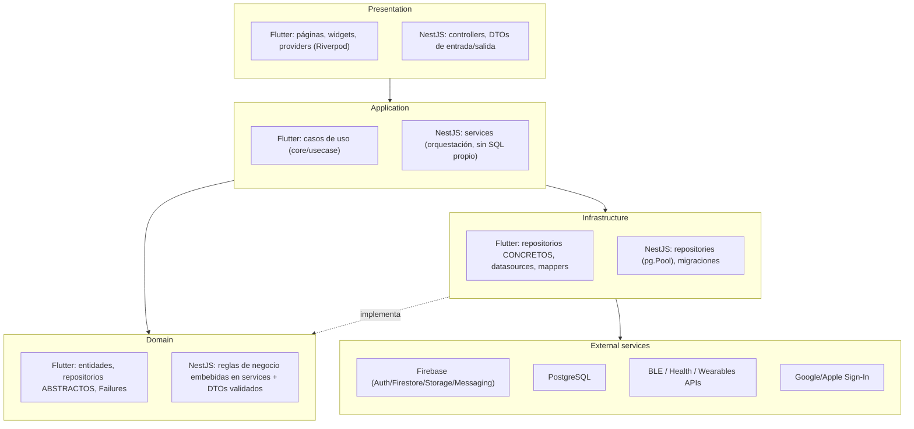
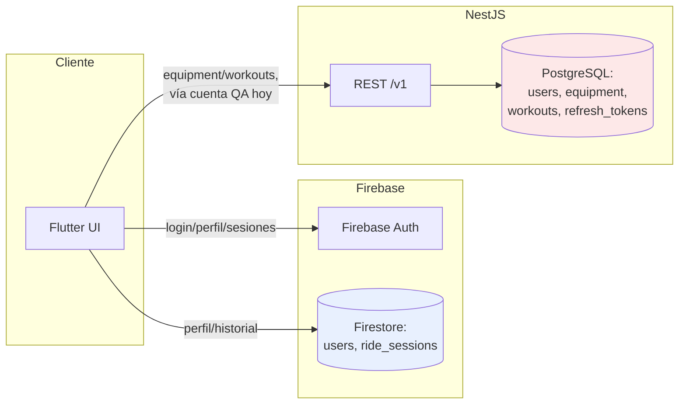
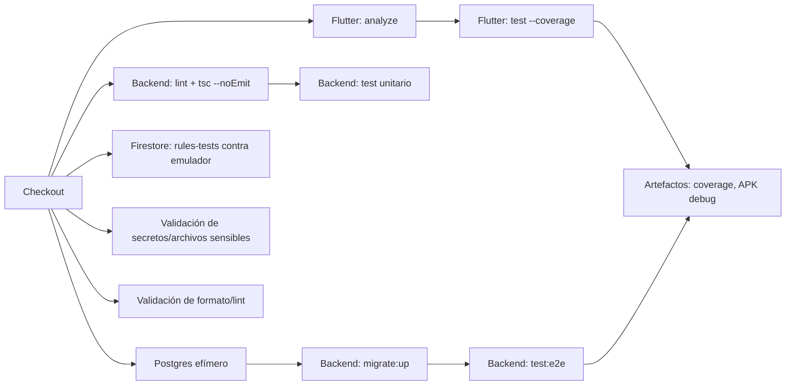

# RidePro — Documento 1: Arquitectura General del Sistema

- **Fecha:** 2026-07-24
- **Rol:** arquitecto principal / desarrollador senior (modo autónomo, ver `ARCHITECTURE_AUDIT_FINAL.md` para el registro completo de la sesión)
- **Estado de este documento:** primera versión — auditoría de estado actual + arquitectura objetivo + plan de transición. No implementa módulos nuevos.
- **Plataformas objetivo declaradas:** Android, iOS, Web, Windows.
- **Stack actual:** Flutter (cliente), NestJS + PostgreSQL (backend propio), Firebase (Auth/Firestore/Storage/Messaging/Analytics/Crashlytics).

> Este documento se apoya en, y no duplica, la documentación técnica ya existente en el repo: `ARCHITECTURE_DECISIONS.md`, `docs/TECHNICAL_SPECIFICATION_M0_M1.md`, `docs/TECHNICAL_SPECIFICATION_BLOQUE_D.md`, `docs/OFFLINE_FIRST.md`, `docs/SECURITY_AUDIT.md`, `ROADMAP_M0_M1.md`, `CI_CD_GUIDE.md`, `BLE_PERMISSIONS.md`, `WEARABLES_SETUP.md`, `HEALTH_SETUP.md`, `PLATFORM_SETUP.md`. Donde este documento y uno de esos difieran en un hecho verificable (no en una decisión de diseño), gana la evidencia más reciente citada aquí.

---

## Índice

1. [Auditoría del estado actual](#1-auditoría-del-estado-actual)
2. [Arquitectura objetivo](#2-arquitectura-objetivo)
3. [Estrategia modular](#3-estrategia-modular)
4. [Estrategia de backend](#4-estrategia-de-backend-monolito-modular-vs-microservicios)
5. [Estrategia de datos](#5-estrategia-de-datos)
6. [Entornos](#6-entornos)
7. [Multiplataforma](#7-multiplataforma)
8. [Seguridad base](#8-seguridad-base)
9. [Sincronización y funcionamiento offline](#9-sincronización-y-funcionamiento-offline)
10. [Rendimiento y carga bajo demanda](#10-rendimiento-y-carga-bajo-demanda)
11. [Pruebas y calidad](#11-pruebas-y-calidad)
12. [CI/CD y despliegue](#12-cicd-y-despliegue)
13. [Plan de transición](#13-plan-de-transición)
14. [Criterios de aceptación de este documento](#14-criterios-de-aceptación-de-este-documento)

---

## 1. Auditoría del estado actual

### 1.1 Estructura completa del repositorio

```
rouvy_pro/
├── lib/                    # Cliente Flutter (Clean Architecture por feature)
│   ├── app/                # Bootstrap de la app, router, tema, widgets globales
│   ├── core/                # Transversal: DI, errores, red, BLE, health, sync, utils
│   ├── demo/                # Modo demo (fakes/fixtures), ver docs/DEMO_MODE.md
│   ├── features/            # 10 features, cada una data/domain/presentation
│   └── l10n/                 # es/en, generado por flutter gen-l10n
├── test/                     # Tests Flutter (unit + widget), estructura espejo de lib/
├── android/, ios/, web/       # Proyectos nativos generados por plataforma
│   └── (sin windows/ — ver 1.14)
├── backend/                  # NestJS + PostgreSQL, monolito modular
│   ├── src/
│   │   ├── common/            # Guards, filtros, excepciones, utilidades compartidas
│   │   ├── config/             # database.config.ts, cors.config.ts
│   │   ├── database/           # DatabaseModule (pg.Pool)
│   │   ├── jwt/                 # TokenService (RS256), módulo global
│   │   └── modules/              # auth, users, equipment, workouts, refresh-tokens
│   ├── migrations/                # SQL versionado a mano, aplicado con node-pg-migrate
│   ├── scripts/                    # Tooling de QA (seed_qa_workouts.js)
│   └── test/                        # e2e (supertest + Postgres real)
├── firebase/
│   ├── rules-tests/                  # Tests de firestore.rules contra el emulador
│   └── seed/                          # Seed de datos QA para el emulador
├── firestore.rules, firestore.indexes.json, firebase.json
├── .github/workflows/ci.yml           # 3 jobs: Flutter, Firestore rules, Backend
├── docs/                               # Documentación técnica (specs, auditorías, ADRs nuevos)
└── *.md (raíz)                          # Guías operativas (setup, CI, permisos, etc.)
```

**Conteo de evidencia (2026-07-24):**

| Área | Cantidad |
|---|---|
| Features Flutter (`lib/features/*`) | 10: `achievements`, `auth`, `device_connection`, `home`, `profile`, `routes_catalog`, `settings`, `training`, `wearables`, `workouts` |
| Módulos backend (`backend/src/modules/*`) | 5: `auth`, `users`, `equipment`, `workouts`, `refresh-tokens` |
| Migraciones SQL aplicadas | 4 (`0001_init` → `0004_workouts`) |
| Tests Flutter (`*_test.dart`) | 39 archivos |
| Tests backend unitarios (`*.spec.ts`) | 8 archivos |
| Tests backend e2e (`*.e2e-spec.ts`) | 7 archivos |
| Tests de reglas Firestore | 1 suite, 28 casos (`firebase/rules-tests`) |

### 1.2 Organización de Flutter

Clean Architecture consistente **por feature**, no por capa global — cada carpeta bajo `lib/features/<nombre>/` replica `data/domain/presentation` de forma independiente. Evidencia: los 10 features siguen el mismo patrón sin excepción (verificado por inspección directa de `lib/features/*/`).

- **`domain/`**: entidades (`Equatable`, sin dependencias de Flutter ni de paquetes externos salvo `dartz`/`equatable`), repositorios abstractos, casos de uso (`core/usecase/usecase.dart` define el contrato base).
- **`data/`**: modelos (serialización), datasources (Firestore/Dio/BLE según el feature), implementaciones de repositorio que traducen excepciones de datasource a `Failure` de dominio.
- **`presentation/`**: páginas (`ConsumerWidget`/`ConsumerStatefulWidget` de Riverpod), providers (`riverpod_generator` en algunos, `Provider`/`Notifier` manual en otros), widgets propios del feature.

**Two features son solo `presentation/`** (`home`, `settings` parcialmente, `profile`): son puntos de composición/entrada que orquestan otros features, no dueños de datos propios — correcto arquitectónicamente, no un hueco.

**`lib/core/`** es la capa transversal — 11 subcarpetas, cada una con una responsabilidad acotada (no hay un "core" cajón de sastre): `ble`, `config`, `di`, `error`, `health`, `network`, `platform`, `sync`, `usecase`, `utils`, `widgets`.

**`lib/demo/`**: modo demo independiente (`main_demo.dart` como entry point alternativo, fakes/fixtures propios) — desacoplado del código de producción, no contamina `lib/features/`.

### 1.3 Organización del backend NestJS

Un módulo Nest por dominio, siguiendo el estándar `module.ts` / `controller.ts` / `service.ts` / `repository.ts` / `dto/*.dto.ts` (convención ya documentada en `docs/TECHNICAL_SPECIFICATION_BLOQUE_D.md` sección 0.2 y verificada por inspección de los 5 módulos existentes — sin excepciones).

- **Sin ORM**: `pg.Pool` directo (`src/config/database.config.ts`), migraciones SQL versionadas a mano. Decisión explícita y documentada (no un descuido) — ver ADR-0002 para el análisis completo de esta decisión en el contexto de PostgreSQL vs Firestore.
- **`src/common/`**: `JwtAuthGuard` + `@CurrentUser()` (autenticación), `assertOwned()` (autorización por ownership, reutilizado por `equipment` y `workouts` — ver 1.16 para el hallazgo de por qué existe), `ApiExceptionFilter` (sobre de error único), `pg-error.util.ts` (traducción de errores de Postgres a errores de dominio).
- **`src/jwt/`**: módulo `@Global()` — ver el docblock de `TokenService` para la justificación de por qué vive fuera de `AuthModule` (evita un import circular con `UsersModule`).
- **`src/config/`**: patrón establecido de "una función `resolveX()`/`createX()` por preocupación de configuración, siempre validando y fallando explícito si falta algo" (`database.config.ts`, `cors.config.ts`) — es el patrón a seguir para cualquier configuración nueva (ver 2.4).

### 1.4 Dependencias entre módulos (matriz, backend)

| Módulo | Depende de | Expone a |
|---|---|---|
| `JwtModule` (global) | — | `AuthModule`, `common/auth/JwtAuthGuard` |
| `DatabaseModule` | — | Todos los módulos con repositorio |
| `AuthModule` | `UsersModule` (repositorio), `JwtModule`, `RefreshTokensModule` | `common/auth` (guard verifica tokens que este módulo emite) |
| `UsersModule` | `DatabaseModule` | `AuthModule` |
| `RefreshTokensModule` | `DatabaseModule` | `AuthModule` |
| `EquipmentModule` | `DatabaseModule`, `common/auth`, `common/ownership` | — (hoja) |
| `WorkoutsModule` | `DatabaseModule`, `common/auth`, `common/ownership` | — (hoja) |

**Sin ciclos.** `EquipmentModule` y `WorkoutsModule` son hermanos, no se conocen entre sí — correcto, no hay razón de negocio hoy para que lo hagan.

**Matriz de dependencias, cliente Flutter (por feature, nivel `domain`→`domain`):**

| Feature | Depende del dominio de | Motivo |
|---|---|---|
| `home` | `auth`, `training`, `routes_catalog`, `workouts` | Página de composición (tarjetas de entrada) |
| `profile` | `auth`, `device_connection`, `workouts` | Composición + navegación a otros features |
| `training` | `device_connection`, `wearables` (indirecto, vía providers) | HUD consume telemetría BLE ya agregada |
| `workouts` | — | Aislado, solo habla con `core/network` (backend propio) |
| `device_connection` | — | Aislado, solo BLE |
| `wearables` | — | Aislado, solo `core/health` + adapters propios |
| `auth`, `routes_catalog`, `achievements`, `settings` | — | Aislados |

**Hallazgo:** ningún feature depende de la capa `data`/`presentation` de otro — todo acoplamiento cruzado pasa por `domain` (entidades/interfaces) o por composición en `presentation` (páginas que embeben widgets de otro feature, nunca importan sus repositorios). Esto es exactamente la regla de dependencia que la arquitectura objetivo (sección 2) formaliza — **ya se cumple en la práctica**, este documento la hace explícita para que no se erosione a medida que el equipo crezca.

### 1.5 Uso actual de Firebase y PostgreSQL

**Hallazgo estructural más importante de esta auditoría:** el proyecto tiene **dos sistemas de autenticación y persistencia completamente independientes, corriendo en paralelo, sin puente entre ellos todavía**:

1. **Firebase** (Auth + Firestore + Storage + Messaging + Analytics + Crashlytics) — sistema **original**, usado por `auth`, `home`, `profile` (parcialmente), `training`, `wearables`, `routes_catalog`, `achievements`, `settings`. Fuente de verdad de: identidad de usuario para toda la app, perfil (`users/{uid}`), historial de sesiones (`users/{uid}/ride_sessions`).
2. **NestJS + PostgreSQL** — sistema **nuevo** (Bloque C/D), usado únicamente por `workouts` y el módulo backend `equipment` (sin datasource Flutter todavía — ver 1.16). Tiene su **propio** `auth` (JWT RS256, `register`/`login`/`refresh`, tabla `users` propia) que **no sabe nada de Firebase Auth**.

Esto no es un descuido: está documentado como decisión explícita (`docs/TECHNICAL_SPECIFICATION_M0_M1.md` sección 0 — "nota de reconciliación arquitectónica" — y `docs/TECHNICAL_SPECIFICATION_BLOQUE_D.md` sección 0.1 — "todo lo nuevo va directo a PostgreSQL/NestJS, no a Firestore"). Pero el **puente entre ambos sistemas de auth no existe todavía**: hoy, para que un usuario autenticado con Firebase pueda usar Workouts, el cliente Flutter usa una cuenta de prueba fija (`DevBackendTestUser`, solo en `kDebugMode`, ver `lib/core/config/dev_backend_test_user.dart`) en vez de una sesión real vinculada al usuario de Firebase. Está documentado como deuda técnica explícita en el propio archivo ("reemplazar por la pantalla de login real... o por una capa de intercambio Firebase → backend, antes de exponer Workouts a usuarios reales"). Este documento lo formaliza como **riesgo P0** (sección 13) y como **ADR-0003** (estrategia de autenticación).

**PostgreSQL, en detalle** (ver sección 5 para la tabla completa de fuente de verdad):
- `users`, `roles`, `user_roles`, `refresh_tokens`, `ride_sessions` (⚠️ existe en el esquema pero está **duplicada** conceptualmente con `Firestore ride_sessions` — ninguna fila se escribe ahí hoy, es un remanente del diseño original antes de la decisión de mantener sesiones en Firestore; ver 1.16), `audit_log` (⚠️ tabla definida, **sin ningún INSERT en todo el código backend** — ver 1.16).
- `equipment`, `equipment_categories` (Bloque D1).
- `workouts`, `workout_intervals` (Bloque D2).

### 1.6 Configuración de entornos

**No existe una matriz formal de entornos (dev/QA/staging/producción) hoy.** Lo que sí existe:

- **Backend**: `backend/.env` (gitignored) + `backend/.env.example` (versionado, documentado). Sin distinción real dev/staging/prod más allá de `NODE_ENV` (solo consumido, hoy, por `cors.config.ts` — no gatea logging, ni ningún otro comportamiento).
- **Flutter**: `--dart-define-from-file=dart_define.local.json` (gitignored) para credenciales QA y el flag `USE_FIREBASE_EMULATORS`; `kDebugMode`/`kReleaseMode` del propio compilador Dart para separar debug de producción — esto sí es robusto (código muerto garantizado por el compilador en release, no una convención).
- **Firebase**: un único proyecto real (`ridepro-dbafe`) usado tanto en desarrollo como el que sería producción — **no hay proyecto Firebase separado por entorno** (riesgo, ver sección 6 y 8).
- **Sin staging**: no existe ningún entorno intermedio entre "developer local" y "lo que sería producción" — ni backend desplegado, ni base de datos, ni proyecto Firebase de staging.

Esto se formaliza en la sección 6.

### 1.7 Autenticación y autorización

Ver 1.5 para el hallazgo de los dos sistemas. En detalle, cada uno:

**Firebase Auth**: gestionado por el SDK, JWT firmado por Google (RS256, 60 min, renovado automáticamente). Autorización: reglas de Firestore (`firestore.rules`, deny-by-default, ya auditadas — `docs/SECURITY_AUDIT.md`, vulnerabilidad crítica encontrada y corregida el 2026-07-21, 28/28 tests de seguridad en verde).

**NestJS**: JWT RS256 propio (`TokenService`, claves en archivo vía `JWT_PRIVATE_KEY_PATH`/`JWT_PUBLIC_KEY_PATH`, nunca hardcodeadas), refresh tokens opacos con **rotación obligatoria y detección de reuso** (si se reutiliza un refresh token ya rotado, se revocan todos los tokens activos del usuario — defensa estándar contra robo de token, ya implementada). Autorización: `JwtAuthGuard` + `assertOwned()` (patrón "404, no 403" para no confirmar existencia de un recurso ajeno — extraído como helper compartido en `src/common/ownership/`, evitando la duplicación que ya se había detectado una vez en Bloque C).

### 1.8 Manejo de errores

**Flutter**: patrón funcional consistente — `Either<Failure, T>` (`dartz`) en todos los repositorios de dominio, `AppErrorHandler` centraliza el mapeo de excepciones (`DioException`, `FirebaseException`, etc.) a `Failure` tipado. Recién extendido (esta sesión previa) para mapear el sobre de error del backend NestJS (`{error: {code, message}}`) a `NotFoundFailure`/`ConflictFailure`/`ValidationFailure`/`AuthFailure` específicos en vez de un `ServerFailure` genérico.

**Backend**: `ApiExceptionFilter` global, sobre de error único documentado en la spec (sección 1.2). `pg-error.util.ts` traduce errores nativos de Postgres (p. ej. `23505 unique_violation`) a excepciones de dominio con código HTTP correcto, evitando que un error de base de datos crudo llegue al cliente.

**Consistencia:** ambos lados del stack usan el mismo principio (nunca exponer el error crudo del proveedor subyacente al llamador final), implementado de forma independiente pero coherente. No hay un contrato compartido formal entre el sobre de error de Firebase y el de NestJS — son dos vocabularios de error distintos que conviven (consecuencia directa de 1.5).

### 1.9 Inyección de dependencias

**Flutter**: `GetIt` como service locator, registro **manual** en `core/di/injection.dart` (no `injectable` + `build_runner`, pese a que ambos están en `pubspec.yaml` como dependencias — código generado no encontrado en el repo, es decir, la generación automática **no se usa hoy**, es una dependencia lista para adoptar, no adoptada). Ya documentado como punto de vigilancia en `docs/TECHNICAL_SPECIFICATION_M0_M1.md` (cuello de botella #4): migrar a `injectable` cuando `injection.dart` supere ~300 líneas legibles con dificultad. Estado actual: ~250 líneas, todavía manejable.

**Backend**: DI nativa de NestJS (decoradores `@Injectable()`, `@Module()`) — estándar del framework, sin desviaciones.

### 1.10 Navegación

`go_router` (Flutter), declarativo, rutas centralizadas en `lib/app/router/app_router.dart`. Sin lazy-loading de rutas hoy (todas las páginas se registran en el mismo árbol al arrancar) — ver sección 10 para la recomendación.

### 1.11 Pruebas

Ver conteos en 1.1. **Pirámide actual, real:**
- **Unit + widget (Flutter)**: 39 archivos, cobertura amplia de `domain`/`data`, cobertura parcial de `presentation` (algunos `*_page_test.dart`, no todos).
- **Unit (backend)**: 8 archivos — servicios de `users`/`equipment`/`workouts`/`auth`, guard de JWT, utilidades (`pg-error`, `assertOwned`).
- **e2e (backend)**: 7 archivos, contra Postgres **real** (no mocks) vía `supertest` — incluye un caso de condición de carrera (`auth-email-race.e2e-spec.ts`).
- **Reglas de Firestore**: 28 casos contra el emulador real.
- **Integración/e2e de Flutter (`integration_test/`)**: **no existe** — la dependencia `integration_test` está declarada en `pubspec.yaml` pero no hay ningún archivo bajo ese directorio. Hueco real de la pirámide (ver sección 11).
- **Contratos de API**: no hay tests de contrato formales (p. ej. Pact, esquemas OpenAPI validados) entre Flutter y el backend NestJS — la validación hoy es indirecta (los e2e del backend verifican el DTO, los tests de Flutter mockean la respuesta esperada; nada verifica automáticamente que ambos coincidan).

### 1.12 CI/CD

`.github/workflows/ci.yml`, 3 jobs (`flutter-checks`, `firestore-rules-tests`, `backend-tests`), disparados en push/PR a `main`/`master` + manual. **Corregido esta sesión** (commit local `79a073c`, no pusheado): el job de backend solo aplicaba la primera migración y nunca proveía claves JWT — probablemente fallaba en cada corrida desde que se añadieron las migraciones 2-4. Validado localmente contra Postgres real en Docker (57/57 e2e en verde tras el fix).

**`CI_CD_GUIDE.md` está desactualizado**: describe un escenario "el repo todavía no existe en GitHub", pero `git remote -v` confirma que `origin` ya apunta a un repositorio real (`github.com/freddyestebancuervo/rouvy_pro`) y `main` ya tiene upstream (`origin/main`) — es decir, **ya hubo al menos un push exitoso en algún momento anterior a esta sesión**, de alguien con acceso, no de este agente. Este documento no fue tocado (fuera del alcance de esta tarea), se deja registrado como deuda de documentación.

### 1.13 Docker

**No existe ningún `Dockerfile` ni `docker-compose.yml` en el repositorio.** El único uso de Docker es:
- Implícito en CI (`services: postgres:16` de GitHub Actions, no un Dockerfile propio).
- Ad hoc, manual, durante esta sesión de auditoría (contenedores `postgres:16` levantados a mano con `docker run` para validar migraciones/e2e, luego eliminados).

No hay forma reproducible de levantar el entorno de desarrollo completo (backend + Postgres + emulador de Firebase) con un solo comando. Ver sección 12 y el plan de transición.

### 1.14 Configuración multiplataforma

Carpetas nativas presentes: `android/`, `ios/`, `web/`. **`windows/` no existe** — pese a que `firebase_options.dart` ya tiene un bloque `DefaultFirebaseOptions.windows` (generado por `flutterfire configure`, con `appId: '...:web:10f330e27c347846c16c14'` — nótese que es literalmente la config de **Web** reutilizada como placeholder para Windows, patrón estándar de Flutter para desktop que usa Firebase JS SDK vía webview, pero **nunca se ejecutó `flutter create --platforms=windows`** sobre este proyecto). Windows es una plataforma **declarada como objetivo pero sin proyecto nativo generado todavía** — hueco real, no ambigüedad.

Ver sección 7 para el detalle completo de qué está compartido vs qué necesita adaptador por plataforma.

### 1.15 Archivos generados, duplicados o temporales

- **Generados correctamente ignorados**: `lib/l10n/generated/*.dart` (versionados, correcto — `flutter gen-l10n` los regenera pero el equipo los commitea para no depender del build step en cada checkout, patrón válido y consistente), `backend/dist/`, `build/`, `*.g.dart`/`*.freezed.dart` (excluidos del analyzer).
- **Sin duplicación de código funcional detectada** en esta pasada — el proyecto ya tiene un historial de extraer helpers compartidos activamente cuando detecta duplicación (`assertOwned`, `createTestApp()` en los e2e del backend, el propio patrón Adapter de wearables) en vez de dejarla acumularse.
- **Temporales**: ya resueltos en la sesión de limpieza previa de este mismo día (`.gitignore` cerrado para `node_modules/`, `.playwright-mcp/`, `coverage/`, basura de Windows — ver `docs/AUDITORIA_FINAL.md`).
- **Un archivo con diff de contenido vacío** (`android/app/src/main/java/io/flutter/plugins/GeneratedPluginRegistrant.java`, solo ruido de fin de línea LF→CRLF) sigue sin comitear, decisión ya tomada explícitamente en una sesión anterior.

### 1.16 Deuda técnica y riesgos estructurales (hallazgos nuevos de esta auditoría)

| # | Hallazgo | Evidencia | Severidad |
|---|---|---|---|
| 1 | Dos sistemas de autenticación (Firebase / NestJS) sin puente real | `dev_backend_test_user.dart`, docblock propio | **Alta** — bloquea exponer Workouts a usuarios reales |
| 2 | Tabla `audit_log` (Postgres) definida pero sin un solo `INSERT` en todo `backend/src/` | `grep -rn audit_log backend/src` → 0 resultados | Media — auditoría de acciones críticas es requisito de seguridad (sección 8) y hoy no existe pese a que el esquema sugiere que sí |
| 3 | Tabla `ride_sessions` duplicada conceptualmente entre Postgres (`0001_init.sql`) y Firestore (fuente de verdad real, ver 1.5) | Migración 0001 + `docs/OFFLINE_FIRST.md` | Baja — no genera bugs hoy (nadie escribe en la de Postgres), pero es señal de esquema no depurado tras el pivote a Firestore para esta colección |
| 4 | Sin `windows/` nativo pese a ser plataforma objetivo declarada | Ausencia de carpeta + config de Firebase ya generada para Windows | Media |
| 5 | Sin Docker/docker-compose — onboarding de desarrollo no reproducible con un comando | Ausencia de `Dockerfile`/`docker-compose.yml` | Media |
| 6 | `integration_test/` sin uso pese a estar declarado como dependencia | Ausencia del directorio | Baja |
| 7 | `logger` (paquete) declarado en `pubspec.yaml`, cero usos en `lib/` | `grep -rl "package:logger" lib` → 0 | Baja (limpieza) |
| 8 | `CI_CD_GUIDE.md` desactualizado (asume que el repo no está en GitHub) | `git remote -v` muestra `origin` real con `main` ya pusheado | Baja (deuda de documentación) |
| 9 | Sin matriz formal de entornos (dev/QA/staging/prod) | Ver 1.6 | Alta — condiciona directamente la sección 6 |
| 10 | Sin tests de contrato entre Flutter y el backend NestJS | Ver 1.11 | Media |

### 1.17 Clasificación general

| Categoría | Contenido |
|---|---|
| ✅ **Correctamente implementado** | Clean Architecture por feature (Flutter), monolito modular por dominio (backend), patrón Adapter para wearables, offline-first de Firestore, reglas de seguridad de Firestore (auditadas y corregidas), rotación de refresh tokens con detección de reuso, ownership pattern (404 no 403), rate limiting en capas, CORS con allowlist (corregido esta sesión), credenciales QA vía variables de entorno (corregido esta sesión), CI con 3 jobs (migraciones/JWT corregidos esta sesión), degradación local (no global) para capacidades de plataforma ausentes (Web Bluetooth). |
| 🟡 **Parcialmente implementado** | Auth NestJS (existe, pero sin puente con Firebase Auth ni pantalla de login real — solo cuenta QA de debug), wearables (2/6 proveedores reales, 4 simulados con mock explícito y documentado), recuperación de sesión tras cierre inesperado (`checkForRecoverableSnapshot` existe en el controlador, alcance exacto no verificado en esta auditoría — pendiente de revisión de código en detalle si se prioriza), rutas (mock local, D3 "no iniciada" según el propio roadmap). |
| 🔴 **Debe corregirse** | Matriz de entornos formal (sección 6), tabla `audit_log` sin escritura real, `windows/` sin generar, ausencia de Docker Compose para desarrollo reproducible. |
| ⚪ **No existe todavía** | Módulos: Eventos, Clubes, Estadísticas (agregadas), Descargas, Notificaciones (más allá de que `firebase_messaging` esté en `pubspec.yaml` sin consumidor visible), Integraciones (más allá de OAuth social y wearables), Creadores, Marketplace, Entrenadores/Gimnasios (como rol operable, no solo como enum de `roles`), IA, Administración (panel). ANT+ (mencionado en un comentario como posibilidad futura, sin paquete ni código real). Video. Sistema de descargas offline de rutas/contenido. |
| ⛔ **No conviene desarrollar todavía** | WebSocket/Redis para tiempo real (explícitamente diferido a M6/multijugador en la spec ya existente — correcto, no hay caso de uso de alta frecuencia/múltiples suscriptores hoy). Microservicios (ver sección 4). Panel de administración (depende de tener primero el núcleo de datos sobre el que administrar — decisión ya documentada en Bloque D, sección 0). Motor de sincronización offline completo para datos no-Firestore (sección 9 define el contrato, no la implementación — no hay todavía un segundo dato fuera de Firestore que lo necesite de forma crítica, salvo Workouts, que hoy asume conexión). |

---

## 2. Arquitectura objetivo

### 2.1 Capas y responsabilidades



**Reglas de dependencia (regla de Dependencia hacia adentro, estilo Clean Architecture — ya vigente en el código, formalizada aquí):**

1. **Domain no importa nada de Application, Presentation ni Infrastructure.** En Flutter esto ya es literal: las entidades y repositorios abstractos de `domain/` no importan `dio`, `cloud_firestore` ni ningún widget. En NestJS es más laxo por convención del framework (los `services` son técnicamente "application + domain" fusionados) — aceptable a esta escala, no se fuerza una separación adicional sin necesidad comprobada (ver sección 4, mismo criterio anti-sobreingeniería).
2. **Application solo conoce Domain**, nunca un detalle concreto de Infrastructure (un caso de uso Flutter recibe un `WorkoutsRepository` abstracto, nunca un `Dio` directo).
3. **Infrastructure implementa Domain**, nunca al revés. Un datasource puede lanzar cualquier excepción nativa del SDK que use; es responsabilidad del repositorio concreto (`data/repositories/`) traducirla a `Failure` antes de que cruce hacia `domain`.
4. **Presentation solo depende de Application/Domain** (casos de uso, providers que exponen `Either<Failure, T>` o estados ya mapeados) — nunca importa un datasource ni un cliente HTTP directamente. Verificado: cero excepciones a esta regla en la matriz de dependencias de 1.4.
5. **External services nunca se referencian por nombre concreto fuera de Infrastructure** — ni un widget ni un caso de uso deberían poder nombrar `FirebaseAuth.instance` o `Dio` directamente (con la única excepción histórica y ya documentada de que `Firebase.initializeApp()`/configuración vive en `main.dart`, que es bootstrap, no dominio).

### 2.2 Estructura de carpetas propuesta

**Flutter — sin cambios estructurales grandes, solo formalización de lo ya vigente + huecos a llenar:**

```
lib/
├── app/                        # (sin cambios)
├── core/
│   ├── ...                      # (sin cambios: ble, config, di, error, health, network, platform, sync, usecase, utils, widgets)
│   └── observability/            # NUEVO — ver sección 8: logging estructurado, wrapper sobre Crashlytics
├── features/
│   ├── <feature>/
│   │   ├── data/
│   │   │   ├── datasources/       # firebase_*, backend_* (Dio), ble_* según corresponda
│   │   │   ├── models/
│   │   │   └── repositories/
│   │   ├── domain/
│   │   │   ├── entities/
│   │   │   ├── repositories/       # abstracto
│   │   │   └── usecases/
│   │   └── presentation/
│   │       ├── pages/
│   │       ├── providers/
│   │       └── widgets/
│   └── ...                          # cada módulo nuevo de la sección 3 sigue este mismo molde
└── l10n/
```

**NestJS — mismo molde ya vigente, formalizado para módulos futuros:**

```
backend/src/
├── common/                       # (sin cambios: auth, database, exceptions, filters, ownership)
├── config/                        # (sin cambios, + nuevas resolveX() según haga falta)
├── database/
├── jwt/
└── modules/
    └── <dominio>/
        ├── <dominio>.module.ts
        ├── <dominio>.controller.ts
        ├── <dominio>.service.ts
        ├── <dominio>.repository.ts
        └── dto/
            ├── create-<dominio>.dto.ts
            ├── update-<dominio>.dto.ts
            └── <dominio>-query.dto.ts
```

**No se propone un monorepo con `packages/` compartidos entre Flutter y NestJS** (p. ej. tipos TypeScript generados desde los DTOs para compartir con un hipotético cliente web en TS) — no hay evidencia de necesidad hoy (el único cliente es Flutter); ver ADR-0005.

---

## 3. Estrategia modular

Para cada módulo: responsabilidad, datos que posee, interfaces públicas, dependencias permitidas, eventos, qué debe quedar desacoplado. **Ninguno de estos módulos se implementa en esta tarea** — es la definición de contrato para cuando se prioricen (ver sección 13).

| Módulo | Estado hoy | Responsabilidad | Datos propios | Interfaz pública | Dependencias permitidas | Eventos | Debe quedar desacoplado de |
|---|---|---|---|---|---|---|---|
| **Autenticación** | 🟡 Dos implementaciones paralelas (1.5) | Identidad, sesión, tokens | Firebase: `users` (Auth); Postgres: `users`, `refresh_tokens` | Flutter: `AuthRepository`; NestJS: `POST /auth/{register,login,refresh}` | Ninguna (es la base) | `UserAuthenticated`, `UserLoggedOut`, `TokenRefreshed` (hoy implícitos vía estado, no eventos formales) | Cualquier lógica de negocio de otro módulo — hoy ya lo está |
| **Usuarios y perfiles** | ✅ (Firestore) | Datos de perfil, preferencias | Firestore `users/{uid}` | `ProfileRepository` | Autenticación | `ProfileUpdated` | Rutas, Entrenamientos, Workouts |
| **Rutas** | 🟡 Mock local, D3 no iniciada | Catálogo de rutas (GPX, elevación, dificultad) | Postgres `routes` (futuro, D3) | `RoutesRepository` | Ninguna | `RouteCompleted` (consumido por Estadísticas/Logros) | Entrenamientos (una ruta no sabe qué workout la usa) |
| **Entrenamientos (training/HUD)** | ✅ | Sesión en vivo, telemetría agregada | En memoria (`TelemetryAggregator`) + Firestore `ride_sessions` (resumen) | `RideSessionController`, `RideSessionRepository` | Sensores (device_connection), Wearables (lectura) | `SessionStarted`, `SessionFinished` | Workouts (una sesión libre no requiere un workout asignado) |
| **Workouts** | 🟡 Backend real, sin puente de auth (1.16 #1) | CRUD de entrenamientos estructurados (series/objetivos) | Postgres `workouts`, `workout_intervals` | `WorkoutsRepository`; NestJS `GET/POST/PATCH /workouts` | Autenticación (backend) | `WorkoutCreated`, `WorkoutArchived` | Entrenamientos en vivo (un Workout es una plantilla, no una sesión) |
| **Sensores** | ✅ (`device_connection`) | Conexión BLE, parsing FTMS/HR | En memoria, sin persistencia propia | `DeviceConnectionRepository`, `BleDataSource` | Ninguna | `DeviceConnected`, `TelemetryReceived` | Entrenamientos (emite telemetría, no sabe qué se hace con ella) |
| **Eventos** | ⚪ No existe | Carreras/retos programados, inscripción | Postgres (futuro) | — | Rutas, Entrenamientos | `EventStarted`, `ParticipantJoined` | Clubes, Marketplace |
| **Clubes** | ⚪ No existe | Grupos de usuarios, membresía | Postgres (futuro) | — | Usuarios | `MemberJoined` | Eventos (un club no es dueño de un evento, puede organizarlo) |
| **Estadísticas** | ⚪ No existe (solo lo que ya expone Firestore por consulta directa) | Agregados históricos (volumen, tendencias) | Postgres, materializado desde Entrenamientos/Workouts/Rutas (ver cuello de botella #3, spec M0/M1) | `StatisticsRepository` (solo lectura) | Entrenamientos, Workouts, Rutas (solo lectura, vía eventos o consulta agregada, nunca escritura directa a sus tablas) | — (consumidor, no emisor) | Debe ser el único módulo que hace joins pesados — nadie más debería agregar datos de otros dominios directamente |
| **Descargas** | ⚪ No existe | Contenido offline (rutas, videos) en el dispositivo | Almacenamiento local del dispositivo | `DownloadManager` (adaptador por plataforma, ver sección 7) | Rutas | `DownloadCompleted`, `DownloadFailed` | Sincronización (una descarga no es una escritura pendiente) |
| **Sincronización** | 🟡 Solo Firestore (offline-first nativo, sección 9) | Cola de operaciones pendientes, reintentos | `shared_preferences`/futura tabla local (sección 9) | `SyncQueue` (contrato, sección 9) | Ninguna — todos los demás módulos lo consumen, él no consume a nadie | `SyncStarted`, `SyncCompleted`, `SyncFailed` | Cualquier lógica de negocio específica de un módulo |
| **Notificaciones** | ⚪ No existe (dependencia sin consumidor) | Push (FCM), in-app | — | `NotificationDispatcher` | Eventos, Clubes, Entrenamientos (como consumidores de sus eventos) | — (consumidor de eventos de otros módulos) | Debe consumir eventos, nunca ser importado directamente por lógica de negocio |
| **Integraciones** | 🟡 (OAuth social + Wearables, ver `ARCHITECTURE_DECISIONS.md`) | Adapters a servicios externos | Ninguno propio | `WearableAdapter` (ya definido) + futuros adapters equivalentes | Ninguna | — | Dominio de cada feature — el patrón Adapter ya garantiza esto |
| **Creadores** | ⚪ No existe | Publicación de contenido (rutas/workouts) por terceros | Postgres (futuro) | — | Rutas, Workouts, Marketplace | `ContentPublished` | Marketplace (crear contenido ≠ venderlo) |
| **Marketplace** | ⚪ No existe | Compra/venta de contenido/servicios | Postgres + pasarela de pago externa | — | Creadores, Entrenadores, Gimnasios | `PurchaseCompleted` | Auth (solo consume identidad, no la gestiona) |
| **Entrenadores** | ⚪ No existe (rol `coach` ya reservado en `roles`, sin funcionalidad) | Gestión de atletas asignados, visibilidad cruzada | Postgres (futuro) | — | Usuarios, Entrenamientos, Workouts (lectura de atletas asignados) | — | Explícitamente fuera de alcance de Bloque D (ver `docs/TECHNICAL_SPECIFICATION_BLOQUE_D.md` 0.1.6) — no construir hasta que exista visibilidad cruzada real |
| **Gimnasios** | ⚪ No existe | Gestión de equipamiento/instalaciones a nivel organización | Postgres (futuro) | — | Equipamiento, Entrenadores | — | Mismo criterio que Entrenadores |
| **IA** | ⚪ No existe | Recomendaciones (rutas, workouts, planificación) | Ninguno propio — consume de otros módulos | — | Estadísticas, Entrenamientos, Workouts (solo lectura) | — | Debe ser 100% opcional/desactivable — ningún módulo core depende de que IA esté disponible |
| **Administración** | ⚪ No existe (decisión explícita de posponer, ver 0.1 de Bloque D) | Panel de gestión de contenido/usuarios | — | — | Todos (lectura/escritura administrativa) | — | Debe reutilizar los repositorios de cada módulo, nunca tener su propio acceso directo a las tablas |

---

## 4. Estrategia de backend (monolito modular vs. microservicios)

**Decisión: monolito modular. No se justifica ninguna extracción a microservicios hoy.** Detalle completo y alternativas descartadas en `docs/architecture/adr/0001-monolito-modular-vs-microservicios.md`. Resumen de la evidencia que sostiene la decisión:

- **5 módulos backend hoy**, cada uno con 1-4 endpoints — el costo de coordinación entre servicios (versionado de contratos, despliegue independiente, observabilidad distribuida, transacciones cross-servicio) superaría ampliamente el beneficio a este volumen.
- **Una sola base de datos, sin señales de necesitar bases de datos separadas por dominio** — no hay conflicto de escalamiento entre `equipment` y `workouts` que justifique aislarlos.
- **Equipo pequeño** (evidencia indirecta: un único desarrollador/agente por sesión de trabajo, sin infraestructura de múltiples equipos) — microservicios resuelven un problema organizacional (equipos que se pisan) que no existe acá.
- **CI ya corre migraciones + e2e contra Postgres real en cada job** — un monolito modular mantiene esto simple; separar en servicios multiplicaría la matriz de CI sin necesidad comprobada.
- **El propio roadmap ya identifica el ÚNICO caso con necesidad real de otra pieza de infraestructura** (WebSocket + Redis para multijugador, M6) y lo trata como una adición futura, acotada, no como justificación para microservicios generales — postura consistente con la que se adopta aquí.

**Camino de escape ya dejado abierto** (para que "empezar con monolito" no sea una decisión irreversible): la separación por módulos de NestJS (uno por dominio, con su propio `repository.ts`) es exactamente la frontera que se usaría el día que un dominio concreto (probablemente Estadísticas o Eventos, por volumen de escritura) necesite escalar o desplegarse por separado — extraerlo sería mover una carpeta, no reescribir límites de datos que nunca se definieron.

---

## 5. Estrategia de datos

**Principio general (ya aplicado, formalizado acá): cada categoría de dato tiene exactamente una fuente de verdad. Ningún dato se escribe en dos lugares "por si acaso".**

| Categoría de datos | Fuente de verdad | Dónde vive hoy | Notas |
|---|---|---|---|
| Identidad/sesión — app principal | Firebase Auth | Firebase | Usado por 8 de 10 features |
| Perfil de usuario (nombre, foto, FTP, peso, `premium`, `role`) | Firestore | `users/{uid}` | Reglas auditadas (`docs/SECURITY_AUDIT.md`) |
| Historial de sesiones de entrenamiento | Firestore | `users/{uid}/ride_sessions` | Append-only por diseño; ver hallazgo 1.16 #3 sobre la tabla Postgres homónima sin uso |
| Identidad/sesión — backend NestJS | PostgreSQL | `users`, `refresh_tokens` | Sistema separado de Firebase Auth — ver hallazgo 1.16 #1 y ADR-0003 |
| Equipamiento | PostgreSQL | `equipment`, `equipment_categories` | — |
| Entrenamientos (Workouts) | PostgreSQL | `workouts`, `workout_intervals` | — |
| Rutas (catálogo) | Mock local hoy; PostgreSQL cuando D3 se priorice | Cliente Flutter (hardcoded) | Ver 1.17 |
| Telemetría BLE en vivo | Memoria del proceso | `TelemetryAggregator` (RAM) | Nunca persistida cruda — solo el resumen final |
| Configuración pública del proyecto Firebase (`apiKey`, `projectId`) | Repositorio (cliente) | `firebase_options.dart`, `google-services.json` | No es secreto por diseño — protegido por Security Rules, no por ocultamiento |
| Secretos de backend (claves JWT, `DATABASE_URL`, credenciales QA) | Variables de entorno / archivos gitignored | `backend/.env`, `backend/secrets/*.pem`, `dart_define.local.json` | Nunca en el repositorio (corregido esta sesión para credenciales QA) |
| Sesión del backend NestJS en el cliente | Almacenamiento seguro del dispositivo | `flutter_secure_storage` (`BackendSessionStore`) | Derivado, nunca fuente de verdad — se puede reconstruir vía login/refresh |
| Auditoría de acciones críticas | **Debería ser PostgreSQL (`audit_log`)** | Esquema existe, **sin escritura real** | Gap — ver 1.16 #2 y sección 8 |

**Diagrama de flujo de datos (alto nivel):**



El color distingue las dos fuentes de verdad que hoy conviven sin puente — es intencional visualmente, para que la brecha no pase desapercibida.

---

## 6. Entornos

**Estado actual: sin matriz formal (hallazgo 1.16 #9).** Diseño propuesto:

| Entorno | Backend (`NODE_ENV`) | Base de datos | Firebase | CORS | Logs | Datos de prueba | Feature flags |
|---|---|---|---|---|---|---|---|
| **Desarrollo** | `development` | Postgres local (Docker, ver sección 12) | Emulador (`USE_FIREBASE_EMULATORS=true`, ya implementado) o proyecto real según necesidad | Fallback automático `localhost`/`127.0.0.1` (ya implementado, `cors.config.ts`) | Verbose, consola | `firebase/seed/`, `backend/scripts/seed_qa_workouts.js` (ya implementados, credenciales vía `.env`/`--env-file`) | Todos activos por defecto |
| **QA** | `development` (o `qa` si se necesita distinguir de dev local) | Postgres efímero (mismo patrón que CI) | Proyecto Firebase **dedicado a QA** (no existe hoy — recomendado, ver riesgos) | `CORS_ALLOWED_ORIGINS` explícita al entorno de QA | Verbose | Seed automatizado en cada despliegue de QA | Todos activos, incluidos los "en prueba" |
| **Staging** | `production`-like pero con `CORS_ALLOWED_ORIGINS`/`DATABASE_URL` propios | Postgres separado de producción | Proyecto Firebase separado (recomendado) | Allowlist de staging únicamente | Info/warn | Datos sintéticos, nunca copia de producción con PII real | Flags nuevos activables aquí antes que en prod |
| **Producción** | `production` | Postgres de producción, con backups | Proyecto Firebase de producción | `CORS_ALLOWED_ORIGINS` = dominios reales únicamente (ya falla cerrado si no se configura, corregido esta sesión) | Warn/error únicamente, sin datos sensibles en texto plano | Ninguno | Flags estables únicamente |

**Protección contra uso accidental de producción desde desarrollo — mecanismos ya existentes + recomendados:**

- ✅ `QaEmulatorConfig`: doble candado (`kDebugMode && --dart-define`) — ya implementado, ver `docs/AUDITORIA_FINAL.md`.
- ✅ `CORS_ALLOWED_ORIGINS`: falla cerrado en producción sin configurar — ya implementado.
- ✅ Credenciales QA nunca hardcodeadas, ya implementado.
- 🔴 **Recomendado, no implementado**: un único proyecto Firebase (`ridepro-dbafe`) sirve HOY tanto para lo que sería desarrollo como producción — no hay forma de que un desarrollador local "apunte a producción por accidente" porque, en la práctica, **desarrollo y producción ya son el mismo proyecto**. Este es el riesgo inverso al que normalmente se protege, y es más grave: no hace falta ningún accidente, es el estado por defecto. Ver sección 8, riesgo crítico.

**Ninguna contraseña, token o credencial QA queda hardcodeada** — verificado exhaustivamente esta sesión (ver `docs/AUDITORIA_FINAL.md`, punto 2): los 3 casos encontrados ya fueron corregidos.

---

## 7. Multiplataforma

| Capacidad | Compartido / Adaptador | Estado | Evidencia |
|---|---|---|---|
| **Bluetooth (BLE)** | Adaptador — `flutter_blue_plus` con soporte condicional en Web (`core/platform/web_bluetooth_support*.dart`, imports condicionales de Dart) | ✅ Implementado, con degradación local documentada (`ARCHITECTURE_DECISIONS.md` #4) | — |
| **ANT+** | No implementado — mencionado en un comentario (`ride_session_controller.dart`) como posibilidad arquitectónica futura, sin paquete ni código real | ⚪ No existe | El dominio ya está desacoplado del transporte (BLE vs ANT+), así que agregarlo no debería tocar `training` |
| **Almacenamiento seguro** | Compartido — `flutter_secure_storage`, ya abstrae Keychain (iOS)/Keystore (Android)/DPAPI (Windows)/localStorage cifrado (Web) | ✅ Implementado (`BackendSessionStore`) | — |
| **Notificaciones** | Adaptador necesario — `firebase_messaging` declarado, sin `NotificationDispatcher` ni consumidor visible | ⚪ Dependencia sin uso | Ver módulo "Notificaciones", sección 3 |
| **Descargas** | Adaptador necesario (API de descarga en background difiere entre plataformas) | ⚪ No existe | Ver módulo "Descargas", sección 3 |
| **Archivos** | Sin necesidad detectada todavía (no hay import/export de archivos en el código actual) | ⚪ No existe | — |
| **Permisos** | Compartido — `permission_handler` ya abstrae el runtime permission model de cada plataforma | ✅ Implementado (`ble_permission_handler.dart`, `BLE_PERMISSIONS.md`) | — |
| **Inicio de sesión social** | Compartido — `google_sign_in`/`sign_in_with_apple`, cada paquete ya abstrae su plataforma | ✅ Implementado (`SETUP_SOCIAL_LOGIN.md`) | — |
| **Ejecución en segundo plano** | Parcialmente cubierto — reconexión BLE tiene lógica de backoff, sin un scheduler de tareas en background (`workmanager` et al. no están en `pubspec.yaml`) | 🟡 Parcial | Cuello de botella #5 de la spec M0/M1 ya señala el riesgo de batería en reconexión agresiva |
| **Sensores** (HR, potencia, cadencia) | Compartido a nivel de dominio (`device_connection`), datos crudos vía BLE | ✅ Implementado | — |
| **Video** | No implementado — sin paquete de reproducción de video en `pubspec.yaml` | ⚪ No existe | Relevante para HUD 3D/video mencionado en `ARCHITECTURE_DECISIONS.md` #3 como contenido pesado futuro |
| **Salud (HealthKit / Health Connect)** | Compartido — paquete `health` unifica ambos SDKs | ✅ Implementado (`HEALTH_SETUP.md`) | — |
| **Windows** | Sin proyecto nativo generado | 🔴 Falta | Ver hallazgo 1.16 #4 |

**Principio de diseño (ya vigente, formalizado):** el dominio nunca depende de una plataforma concreta — toda capacidad específica de plataforma se accede a través de una interfaz en `domain/` (o `core/platform/`), implementada por un adapter en `data/` o `core/`. El caso Web Bluetooth (`ARCHITECTURE_DECISIONS.md` #4) es el ejemplo de referencia a replicar para cualquier capacidad nueva.

---

## 8. Seguridad base

### Principios mínimos (estado: implementado salvo donde se indica)

| Área | Estado | Detalle |
|---|---|---|
| Autenticación | 🟡 Ver 1.5/1.16 #1 | Dos sistemas robustos individualmente, sin puente |
| Autorización | ✅ | `assertOwned` (404 no 403), reglas de Firestore deny-by-default |
| Roles y permisos | 🟡 | `roles`/`user_roles` (Postgres) y `role` (Firestore) existen; ningún módulo real los consume todavía más allá de `premium` como enum |
| JWT y renovación | ✅ | RS256, rotación de refresh token, detección de reuso |
| Almacenamiento de tokens | ✅ | `flutter_secure_storage`, nunca `shared_preferences` para tokens |
| CORS | ✅ (corregido esta sesión) | Allowlist por entorno, falla cerrado en producción |
| Validación de entrada | ✅ | `class-validator` + `ValidationPipe` (`whitelist`, `forbidNonWhitelisted`) en NestJS; validadores propios en Flutter (`core/utils/validators.dart`) |
| Gestión de secretos | ✅ (corregido esta sesión) | Variables de entorno, nunca hardcodeadas — ver `docs/AUDITORIA_FINAL.md` |
| Auditoría de acciones críticas | 🔴 | Tabla existe, sin escritura — ver 1.16 #2 |
| Protección de endpoints | ✅ | `JwtAuthGuard` global por defecto, rate limiting en capas (global + por ruta + específico de `/auth/refresh`) |
| Separación de entornos | 🔴 | Un solo proyecto Firebase para todo — ver sección 6 |

### Riesgos clasificados

| Riesgo | Severidad | Detalle |
|---|---|---|
| Un único proyecto Firebase sirve como "desarrollo" y "producción" a la vez | **Crítico** | Cualquier dato de prueba escrito hoy convive con lo que sería producción real; no hay forma de purgar datos de QA sin riesgo de tocar datos reales. Requiere decisión del propietario (creación de proyectos Firebase separados tiene costo/tiempo de configuración) — **no se ejecuta en esta tarea**, se documenta y se detiene acá según la instrucción explícita del propietario. |
| Auth NestJS sin puente con Firebase Auth — Workouts solo accesible vía cuenta QA fija en debug | **Alto** | Bloquea llevar Workouts a producción real tal como está; ya documentado como deuda técnica por el propio código |
| `audit_log` sin escritura real | **Medio** | Sin trazabilidad de acciones administrativas/críticas si algo sale mal — mitigable sin romper nada (agregar escritura es aditivo) |
| Sin tests de contrato Flutter↔NestJS | **Medio** | Un cambio de DTO en el backend puede romper el cliente sin que ningún test lo detecte hasta runtime |
| Rotación del historial de git pendiente (contraseñas QA viejas en commits anteriores) | **Medio** | Ya documentado en `docs/AUDITORIA_FINAL.md` — requiere autorización explícita del propietario para reescribir historial, **no se ejecuta** |
| Sin Docker Compose — riesgo de "funciona en mi máquina" | **Bajo** | Onboarding lento, no un riesgo de seguridad directo |
| `applicationId` de Android en placeholder | **Bajo** | Bloquea publicación real, no es un riesgo de seguridad en sí |

**Ningún hallazgo de esta sección alcanza el umbral de "deténte y pide autorización antes de un cambio destructivo"** definido por el propietario — todos son aditivos (agregar escritura de auditoría, agregar proyectos Firebase, agregar tests) o requieren una decisión de producto/infraestructura fuera del alcance técnico de este documento (crear proyectos Firebase reales tiene costo y pertenece al propietario decidirlo).

---

## 9. Sincronización y funcionamiento offline

**No se implementa el motor completo en esta tarea** — se dejan definidos los contratos y límites, extendiendo el patrón ya implementado para Firestore (`docs/OFFLINE_FIRST.md`) al caso general (cualquier dato que NO viva en Firestore, hoy principalmente Workouts/Equipment vía NestJS).

### Contrato: `SyncQueue` (propuesto, no implementado)

```dart
abstract class PendingOperation {
  String get id;              // UUID generado en el cliente, idempotencia (ver abajo)
  String get endpoint;
  Map<String, dynamic> get payload;
  DateTime get createdAt;
  int get retryCount;
}

abstract class SyncQueue {
  Future<void> enqueue(PendingOperation op);
  Future<List<PendingOperation>> pending();
  Future<void> markCompleted(String id);
  Future<void> markFailed(String id, {required bool retryable});
  Stream<SyncStatus> get statusStream;
}
```

- **Persistencia local**: tabla `pending_writes(id, endpoint, payload_json, created_at, retry_count)` — ya recomendado en `docs/TECHNICAL_SPECIFICATION_M0_M1.md` sección 7.3, con `sqflite`/`drift`. Este documento no elige entre ambos todavía (decisión de bajo riesgo, diferible hasta que el primer consumidor real exista).
- **Cola de operaciones + reintentos**: mismo patrón de backoff exponencial ya usado dos veces en el proyecto (reconexión BLE, reconexión de wearables) — reutilizar, no inventar un tercer mecanismo (principio ya establecido en la spec M0/M1 sección 7.3).
- **Idempotencia**: cada `PendingOperation` lleva un `id` generado en el cliente (UUID), enviado al backend como header o campo del payload; el backend debe tratar un `id` repetido como "ya procesado, devolver el resultado anterior" — **esto todavía no existe en los endpoints de NestJS actuales** (ninguno acepta un idempotency key hoy) — requisito a incorporar antes de construir el motor de sincronización real para Workouts/Equipment.
- **Resolución de conflictos**: mismo criterio ya documentado para Firestore (`docs/OFFLINE_FIRST.md` sección 3) — last-write-wins a nivel de recurso completo para datos editables (p. ej. un `workout`), append-only sin conflicto posible para datos históricos.
- **Evitar duplicados**: consecuencia directa de la idempotencia — sin ella, un reintento tras un timeout ambiguo (¿llegó el POST original o no?) puede crear un recurso dos veces. Es el motivo por el que este contrato se define ahora aunque no se implemente: **cualquier escritura nueva contra NestJS debería aceptar un idempotency key desde el día uno**, para no tener que migrar endpoints ya en uso después.
- **Recuperación de sesión**: ya existe una pieza parcial (`RideSessionController.checkForRecoverableSnapshot()`) para sesiones de entrenamiento en curso — su alcance exacto (¿persiste ya un snapshot, o solo expone el método?) no se verificó línea por línea en esta auditoría; queda como acción de seguimiento de bajo riesgo (leer el archivo, confirmar o corregir la clasificación 🟡 de 1.17).
- **Sincronización al volver la conexión**: mismo patrón que `FirestoreSyncService` (`NetworkInfo.onConnectivityChanged` + drenar la cola en orden) — el contrato de `SyncQueue` de arriba está diseñado para que `FirestoreSyncService` y un futuro `BackendSyncService` compartan la misma forma de exponer `SyncStatus` a `ConnectivitySyncBanner`, sin duplicar el widget de UI.

---

## 10. Rendimiento y carga bajo demanda

| Norma | Estado actual | Recomendación |
|---|---|---|
| Lazy loading de rutas | 🔴 No implementado — `go_router` registra todo el árbol al iniciar | `go_router` soporta `redirect`/builders diferidos; evaluar cuando el árbol de rutas crezca con los módulos de la sección 3 (no urgente con 10 features) |
| Paginación | 🟡 Parcial — `ride_sessions` ya usa `limit(30)` (Firestore); DTOs de `workouts`/`equipment` en NestJS incluyen `*-query.dto.ts` (evidencia de paginación ya contemplada en el contrato) | Confirmar que TODOS los listados nuevos (Estadísticas, Eventos) sigan el mismo patrón desde el diseño, no como parche posterior |
| Caché | 🟡 Firestore cachea nativo (offline-first); NestJS no tiene caché de lectura (aceptable al volumen actual) | No introducir Redis solo para caché sin medir primero (mismo criterio anti-sobreingeniería de la sección 4) |
| Imágenes | ⚪ Sin política explícita encontrada | Definir cuando el primer feature con imágenes de usuario (fotos de perfil ya existen — `photoUrl` — pero sin pipeline de resize/compresión visible) se revise a fondo |
| Video | ⚪ No implementado (sección 7) | Diseñar solo cuando el módulo de contenido pesado se priorice — evitar cargar el player en el bundle inicial (import diferido) |
| Liberación de memoria | ✅ | `TelemetryAggregator` vive solo durante la sesión activa, se descarta al finalizar (`reset()`) |
| Operaciones pesadas / isolates | 🟡 | Sin evidencia de uso de `compute()`/isolates hoy — el volumen de datos actual (telemetría BLE, parsing FTMS) no lo ha requerido; documentar como umbral a vigilar, no como acción inmediata |
| Evitar reconstrucciones innecesarias (Flutter) | ✅ | Riverpod con providers granulares ya es el patrón — revisar puntualmente si algún `ConsumerWidget` grande no se ha dividido a medida que las pantallas crezcan |
| Evitar N+1 / endpoints sobredimensionados (backend) | ✅ | `pg.Pool` con queries explícitas (no ORM lazy-loading, que es la fuente más común de N+1) — cada `repository.ts` revisado en esta auditoría hace consultas acotadas por endpoint |

**Carga bajo demanda para features futuras** (modo infantil, gimnasio, marketplace, IA): la estructura modular por feature (sección 2.2) ya es compatible con lazy-loading a nivel de Dart (imports diferidos, `deferred as`) — no requiere ningún cambio estructural previo, solo aplicar la técnica cuando el primero de estos módulos exista.

---

## 11. Pruebas y calidad

### Pirámide objetivo (vs. estado actual, ver 1.11)

| Nivel | Estado actual | Objetivo |
|---|---|---|
| Unitarias (Flutter) | ✅ Amplia en `domain`/`data` | Mantener — exigir para todo caso de uso/repositorio nuevo |
| Widgets (Flutter) | 🟡 Parcial | Exigir al menos un test de widget por página nueva con lógica condicional (loading/error/empty) |
| Integración (Flutter, `integration_test/`) | 🔴 No existe | Introducir para los flujos críticos: login → home, flujo BLE simulado → HUD → resumen |
| End-to-end (backend) | ✅ Contra Postgres real | Mantener — exigir para todo endpoint nuevo |
| Contratos de API | 🔴 No existe | Introducir validación de que los DTOs de NestJS y los modelos de Flutter no diverjan (mínimo: un test que serialice/deserialice el mismo JSON de ejemplo en ambos lados) |
| Migraciones | ✅ (ya validado esta sesión vía Docker) | Formalizar como paso de CI explícito, no solo manual |
| Seguridad | ✅ (Firestore rules, 28/28) | Extender el mismo criterio a cualquier regla de autorización nueva en NestJS |
| Rendimiento | ⚪ No existe | No introducir hasta tener un caso de uso con volumen real que lo justifique (mismo principio anti-sobreingeniería) |

### Validaciones obligatorias en CI antes de aceptar un cambio (recomendado, ver sección 12)

1. `flutter analyze --fatal-infos` — ya en CI.
2. `flutter test --coverage` — ya en CI.
3. Backend: `npm run lint`, `npx tsc --noEmit`, `npm test` (unit) — **lint/tsc no están en CI hoy como pasos explícitos**, solo `test`/`test:e2e` — recomendado añadirlos (P1, sección 13).
4. Migraciones aplicadas limpias contra Postgres efímero — ya en CI (corregido esta sesión).
5. `npm run test:e2e` — ya en CI.
6. Reglas de Firestore — ya en CI.
7. **Validación de secretos/archivos sensibles** (p. ej. `git-secrets`, `gitleaks`, o un grep acotado de patrones de credencial) — **no existe hoy**, recomendado (P1, ver sección 12).
8. **Validación de formato** (`prettier`/`dart format --set-exit-if-changed`) — no existe hoy como paso de CI explícito.

---

## 12. CI/CD y despliegue

**Pipeline actual (3 jobs, ver 1.12) — propuesta de pipeline extendido, aditiva, no un reemplazo:**



Jobs nuevos propuestos respecto al `ci.yml` actual: **D (lint/tsc backend)**, **J (secretos)**, **K (formato)** — los demás ya existen (con el fix de migraciones/JWT de esta sesión, aún sin push). **No se implementa esta extensión en esta tarea** (fuera del alcance explícito: "no propongas un enfoque nuevo sin necesidad" — esto se deja como recomendación priorizada en la sección 13, no como cambio ejecutado).

**No hay pipeline de despliegue (CD) todavía** — ni a staging ni a producción. Coherente con que tampoco existe infraestructura de staging/producción real (sección 6). No se propone uno en detalle aquí porque depende de decisiones de infraestructura (¿dónde se despliega el backend? ¿Cloud Run, un VPS, Render?) que son del propietario, no técnicas — se deja como ítem P2/P3 en el plan de transición.

**No hago push, merge ni despliegues** — confirmado también en `ARCHITECTURE_AUDIT_FINAL.md`.

---

## 13. Plan de transición

**No se propone reescribir nada.** Plan incremental, clasificado y con dependencias explícitas.

| ID | Acción | Prioridad | Depende de | Criterio de finalización |
|---|---|---|---|---|
| T1 | Push del fix de CI ya commiteado localmente (`79a073c`) y validación en un run real de GitHub Actions | **P0** | Autorización del propietario para hacer push (no ejecutado por este agente) | Los 3 jobs de CI en verde en un run real |
| T2 | Decidir puente de autenticación Firebase ↔ NestJS (pantalla de login real contra el backend, o intercambio de token Firebase→JWT propio) | **P0** | T1 (necesita CI verde para iterar con confianza) | Un usuario real (no la cuenta QA) puede usar Workouts de punta a punta |
| T3 | Escribir en `audit_log` para las acciones críticas ya identificadas (login, cambios de rol, borrado de cuenta) | **P1** | Ninguna — aditivo, sin riesgo | Al menos las acciones de `auth`/`users` quedan auditadas, con test que lo verifique |
| T4 | Añadir idempotency key a los endpoints de escritura de NestJS (`workouts`, `equipment`) | **P1** | Ninguna — aditivo | Un POST repetido con el mismo `id` no crea un recurso duplicado, con test e2e que lo pruebe |
| T5 | `docker-compose.yml` para desarrollo local (Postgres + backend) | **P1** | Ninguna | `docker compose up` deja el backend respondiendo `/v1/health` sin pasos manuales adicionales |
| T6 | Extender CI: lint/tsc del backend, validación de secretos, formato | **P1** | T1 | 3 jobs nuevos en verde |
| T7 | Generar proyecto nativo Windows (`flutter create --platforms=windows`) y validar build | **P1** | Ninguna | `flutter build windows` compila sin errores |
| T8 | Tests de integración Flutter (`integration_test/`) para login→home y flujo BLE simulado→HUD | **P2** | T2 (si el flujo de auth cambia, evita reescribir tests dos veces) | Al menos 2 flujos críticos cubiertos |
| T9 | Decidir y crear proyectos Firebase separados por entorno (dev/QA/staging/prod) | **P0** (seguridad) pero **requiere decisión y presupuesto del propietario** | — | **No se ejecuta sin autorización explícita** — documentado como riesgo crítico en sección 8 |
| T10 | Rotar historial de git para las credenciales QA viejas (commits anteriores a esta sesión) | **P1**, pero **requiere autorización explícita** (reescritura de historial) | — | **No se ejecuta sin autorización explícita** |
| T11 | Resolver `applicationId`/`package_name` real de Android | **P2** | Decisión de producto (nombre final) | Build de release firmable |
| T12 | Migrar `injection.dart` a `injectable` + `build_runner` | **P3** | Solo si el archivo cruza el umbral ya documentado (~300 líneas) | N/A hoy — monitoreo, no acción |
| T13 | Tests de contrato Flutter↔NestJS | **P2** | T2 (contrato de auth estabilizado primero) | Un cambio de DTO backend rompe un test antes de llegar a runtime del cliente |
| T14 | Actualizar `CI_CD_GUIDE.md` (desactualizado, ver 1.12) | **P3** | — | Documento refleja que el repo ya está en GitHub |
| T15 | Implementar módulos nuevos (Eventos, Clubes, Estadísticas, etc., sección 3) | **P3** (evolución futura) | T2, T9 (base de auth/entornos estable primero) | Cada uno con su propio criterio, definido cuando se priorice |

**Orden recomendado:** T1 → T9 (decisión del propietario, en paralelo no bloqueante para el resto) → T3/T4/T5/T6/T7 (P1, sin dependencias entre sí, paralelizables) → T2 (el más grande, se beneficia de T1 verde) → T8/T13 → T11/T12/T14 → T15.

---

## 14. Criterios de aceptación de este documento

- [x] Estado actual documentado con evidencia (sección 1, con comandos y archivos citados — detalle completo en `ARCHITECTURE_AUDIT_FINAL.md`).
- [x] Arquitectura objetivo con límites y dependencias claros (sección 2).
- [x] Plan incremental aplicable al proyecto actual, priorizado (sección 13).
- [x] Decisiones importantes con ADR (`docs/architecture/adr/`, ver índice al final de `ARCHITECTURE_AUDIT_FINAL.md`).
- [x] Riesgos priorizados (sección 8).
- [x] Documentos Markdown creados (este archivo + ADRs + auditoría).
- [x] Ningún módulo nuevo iniciado — solo definición de contratos (sección 3).
- [x] Auditoría final entregada para revisión independiente (`docs/audits/ARCHITECTURE_AUDIT_FINAL.md`).
